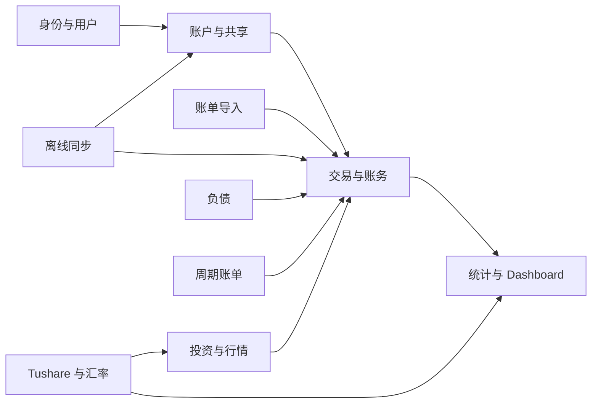
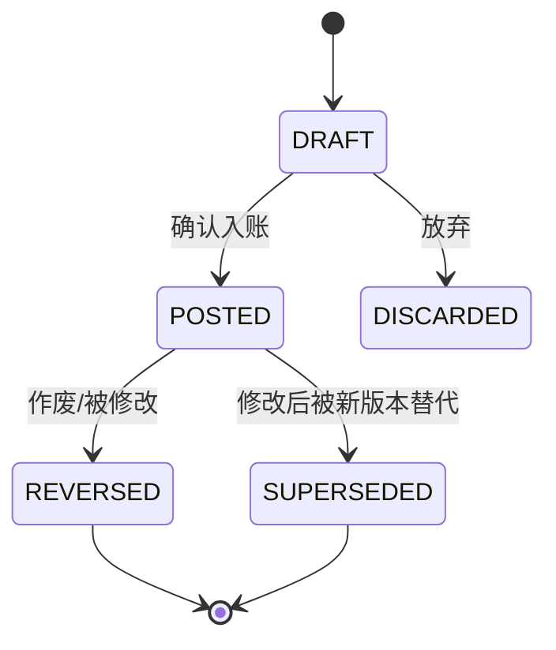

# 资迹 Ziji — 核心领域与账务设计

**文档版本：** V0.1  
**对应产品版本：** V0.1  
**需求基线：** PRD V0.1、RTM V0.1  
**文档状态：** V1 正式设计基线

## 1. 设计目标

本设计定义 V1 的核心领域语言、聚合边界、账务事实源、交易分录规则和统计口径。

优先保证：

1. 任意账户余额可以由有效分录重建。
2. 转账、负债、投资等事件不会被误计为普通收支。
3. 修改和作废保留完整历史证据。
4. 共享比例、价格和汇率变化不会污染账务事实。
5. 离线重试不会重复入账。

对应需求：ACC-*、LED-*、SHR-*、INV-*、LIA-*、DASH-*、FX-*、SYNC-*。

## 2. 通用语言

| 术语 | 定义 | 不包含 |
| --- | --- | --- |
| 账户 Account | 保存某类资产、负债或投资持仓的资金载体 | 收入、支出分类 |
| 交易 Transaction | 用户能够理解的一次完整业务事件 | 单条账户余额变化 |
| 分录 LedgerEntry | 交易对账务科目产生的一条借方或贷方记录 | 可独立修改的流水 |
| 科目 LedgerAccount | 复式账务中的记账对象，包含用户账户及系统对方科目 | 产品界面上的账户分类 |
| 余额 Balance | 指定时点有效分录的汇总结果 | 用户直接保存的独立事实 |
| 流水 | Transaction 的用户界面表达 | 独立于 Transaction 的领域实体 |
| 持仓 Position | 某投资账户中某金融产品的当前数量与成本状态 | 独立于投资交易的原始事实 |
| 价格快照 | 某产品在指定业务时点的收盘价或净值 | 用户成交价 |
| 基准币种 | 用户 Dashboard 的统一展示和统计币种 | 对原币账务的替代 |
| 计入比例 | 共享账户余额进入某个用户个人统计的权重 | 法律所有权比例 |
| 冲正 Reversal | 用等额反向分录抵消已确认交易 | 物理删除 |
| 业务日期 | 入账时由用户确认或按当时用户时区生成、入账后保持不变的权威账务日期 | 服务端 UTC 创建时间、用户后续时区变化 |

## 3. 限界上下文



上下文之间只通过应用服务和稳定 DTO 交互。外部数据源模型不得直接进入账务核心。

## 4. 用户聚合

### 4.1 User

职责：

- 保存用户身份、邮箱状态和个人展示设置
- 提供用户时区和基准币种
- 控制账号状态

关键不变量：

- 规范化邮箱全局唯一
- 未验证邮箱不得完成注册
- 基准币种必须属于 V1 支持列表

认证会话属于身份上下文，不进入账务计算。

## 5. Account 聚合

### 5.1 Account

关键属性：

```text
id
account_class: ASSET | INVESTMENT | LIABILITY
account_type
name
institution
currency
status: ACTIVE | ARCHIVED
version
created_at / updated_at
```

### 5.2 账户与账务科目

每个 Account 对应一个用户可见账务科目：

- 资产账户：借方余额为正
- 负债账户：贷方余额为正
- 投资账户包含现金结算关系和持仓子账，不直接把持仓数量当金额余额

系统内部还维护用户不可直接操作的对方科目：

- `EQUITY_OPENING_BALANCE`：期初权益
- `INCOME_*`：收入科目
- `EXPENSE_*`：支出科目
- `EQUITY_BALANCE_ADJUSTMENT`：余额调整
- `FX_CLEARING`：跨币种清算
- `INVESTMENT_CLEARING`：投资交易清算

Account 与 LedgerAccount 的关系固定为：

- ASSET：一个 `PRIMARY` 主金额科目
- LIABILITY：一个 `PRIMARY` 主金额科目
- INVESTMENT：一个 `PRIMARY` 券商现金科目和一个 `POSITION_COST` 内部持仓成本科目
- 系统收入、支出、权益和清算科目不对应用户可见 Account

投资账户只支持账户币种这一种结算币种；多币种券商账户在 V1 中按币种创建多个投资账户。投资账户的资产价值为 `PRIMARY` 券商现金余额加持仓市值；`POSITION_COST` 只用于账务平衡和成本对账，不再次计入资产总额，避免与持仓市值重复计算。

投资成交仅使用投资账户自身的 `PRIMARY` 券商现金科目结算。外部银行卡和投资账户之间的入金、出金属于普通转账；投资成交命令不得跳过该转账直接改变任意外部现金账户。

### 5.3 账户成员统一模型

所有 Account 均通过 AccountMember 授权，包括只有创建者一人的账户。创建 Account 时在同一事务中创建：

```text
Account
→ 创建者的 ACTIVE OWNER membership 周期
→ 该 membership 的 included=true、ratio=1.000000 计入设置
→ 账户所需 LedgerAccount
```

`Account.created_by` 只用于审计，不能替代 ACTIVE AccountMember 权限判断。

### 5.4 LiabilityDetail

负债账户可以附加：

```text
interest_rate
loan_date
due_date
billing_day
repayment_day
current_amount_due
```

`current_amount_due` 只用于提醒，不是账务余额事实。V1 不自动计提未支付利息和费用；只有正式分录参与负债余额。复杂分期、最低还款、罚息和应计利息自动计算不属于 V1。

### 5.5 状态规则

- 新账户状态为 ACTIVE
- 有历史账务的账户不得删除
- ARCHIVED 账户不允许新增普通交易，但允许必要的冲正和审计修复
- 非零余额归档需要用户显式确认

## 6. Transaction 聚合与复式账务

### 6.1 聚合结构

```text
Transaction (聚合根)
├── LedgerEntry 1..n
├── TransactionVersion 0..n
├── ReversalRelation 0..1
└── TransactionTags 0..n
```

Transaction 负责保证所有 LedgerEntry 原子提交和业务规则一致。

### 6.2 Transaction 状态



交易一旦成功入账，其分录就是不可变账务事实。余额汇总包含所有已经入账的原交易分录和冲正交易分录；两者通过方向相反的分录相互抵消。

`REVERSED` 和 `SUPERSEDED` 表示原交易的业务状态，不表示从账本查询中删除原分录。只有从未入账的 `DRAFT` 和 `DISCARDED` 不参与账本汇总。

### 6.3 分录结构

每条 LedgerEntry 至少包含：

```text
transaction_id
ledger_account_id
currency
direction: DEBIT | CREDIT
amount > 0
business_date
sequence_no
```

数据库存储金额绝对值和借贷方向，禁止同时使用正负号与方向表达同一含义。

### 6.4 平衡规则

对每笔交易、每个币种分别满足：

```text
Σ Debit(amount) = Σ Credit(amount)
```

跨币种交易在各币种内通过 `FX_CLEARING` 科目分别平衡，并在 Transaction 上保存两端原币金额和成交汇率。

平衡检查必须在领域服务和数据库提交边界执行。数据库无法用普通 CHECK 跨行校验时，由延迟约束触发器或受控存储过程在事务提交前校验。

### 6.5 精度和舍入

- 金额：`NUMERIC(24,8)`
- 数量、价格、汇率：`NUMERIC(28,12)`
- 领域计算使用 BigDecimal
- 禁止从二进制浮点构造财务值
- CNY、USD、HKD、EUR 的货币最小单位为 2 位小数，JPY 为 0 位小数
- LedgerEntry、费用、税费和实际成交金额在入账时按币种最小单位使用 `HALF_UP` 舍入
- 输入金额超过币种入账精度时必须拒绝或要求用户明确确认舍入，不能静默处理
- 数量、价格和汇率最多保留 12 位小数，中间乘除不反复舍入
- 持仓成本保留 8 位小数，平均成本保留 12 位小数；全部卖出时释放全部剩余成本
- 估值和汇率折算先按允许精度聚合，最终在快照/API 输出边界按展示币种最小单位舍入一次
- 收益率和比例保留 6 位小数
- 平衡校验使用入账后的精确金额，不接受容差平衡

### 6.6 余额计算

资产科目：

```text
余额 = Σ借方金额 - Σ贷方金额
```

负债、收入、权益科目：

```text
余额 = Σ贷方金额 - Σ借方金额
```

账户余额缓存仅为投影。缓存重建流程：

```text
读取目标时点前所有已入账 LedgerEntry（包含原交易和冲正交易）
→ 按 ledger_account 和 currency 汇总
→ 写入余额快照
→ 对比原缓存并记录差异
```

### 6.7 可用余额

冻结、在途和预留金额不生成 LedgerEntry，因为它们不改变资产所有权；它们作为可审计的 `LiquidityHold` 流动性事实保存。

```text
activeUnavailableAmount(t) = Σ 在 t 时点有效的 FROZEN / IN_TRANSIT / RESERVED hold
availableBalance(t) = ledgerBalance(t) - activeUnavailableAmount(t)
```

可用余额可由账务分录和 LiquidityHold 完整重建。直接覆盖 `availableBalance` 或 `frozenAmount` 均不允许。负可用余额保留并触发 `LIQUIDITY_HOLDS_EXCEED_BALANCE` 警告。

## 7. 修改、作废和冲正

### 7.1 修改已确认交易

```text
原 Transaction V1（POSTED）
→ 创建冲正 Transaction R1
→ 原 Transaction 标记 SUPERSEDED
→ 创建新 Transaction V2（POSTED）
```

R1 的每条分录与 V1 对应分录金额相同、借贷方向相反。

### 7.2 作废已确认交易

```text
原 Transaction（POSTED）
→ 创建冲正 Transaction
→ 原 Transaction 标记 REVERSED
```

### 7.3 限制

- 冲正交易不可单独修改
- 修改和作废必须保存操作者、原因和时间
- 关联退款、投资卖出或后续冲正的交易，修改前必须做影响检查
- 已同步交易禁止通过数据库物理删除

## 8. 标准账务样例

以下样例均以 CNY 为例。`借`和`贷`表示复式账务方向，不等同于资产增减符号。

### 8.1 期初余额 ¥10,000

| 借方 | 贷方 | 金额 |
| --- | --- | ---: |
| 银行卡资产 | 期初权益 | 10,000 |

结果：资产 +10,000；收入 0；净资产 +10,000。

### 8.2 工资收入 ¥8,000

| 借方 | 贷方 | 金额 |
| --- | --- | ---: |
| 银行卡资产 | 工资收入 | 8,000 |

结果：资产 +8,000；收入 +8,000；净资产 +8,000。

### 8.3 现金支付餐饮 ¥50

| 借方 | 贷方 | 金额 |
| --- | --- | ---: |
| 餐饮支出 | 现金资产 | 50 |

结果：资产 -50；支出 +50；净资产 -50。

### 8.4 原餐饮退款 ¥20

| 借方 | 贷方 | 金额 |
| --- | --- | ---: |
| 现金资产 | 餐饮支出 | 20 |

结果：资产 +20；餐饮净支出 -20；普通收入 0。

### 8.5 银行卡转支付宝 ¥1,000

| 借方 | 贷方 | 金额 |
| --- | --- | ---: |
| 支付宝资产 | 银行卡资产 | 1,000 |

结果：资产总额 0 变化；收支 0。

### 8.6 CNY 700 转入 USD 100，实际汇率 7.0

CNY 分录：

| 借方 | 贷方 | 金额 |
| --- | --- | ---: |
| FX 清算-CNY | 银行卡-CNY | 700 CNY |

USD 分录：

| 借方 | 贷方 | 金额 |
| --- | --- | ---: |
| 银行卡-USD | FX 清算-USD | 100 USD |

结果：原币分别平衡；交易保存两端金额和实际汇率。基准币资产变化只来自手续费或实际汇兑差额。

### 8.7 信用卡消费 ¥300

| 借方 | 贷方 | 金额 |
| --- | --- | ---: |
| 购物支出 | 信用卡负债 | 300 |

结果：负债 +300；支出 +300；净资产 -300。

### 8.8 信用卡还本金 ¥300

| 借方 | 贷方 | 金额 |
| --- | --- | ---: |
| 信用卡负债 | 银行卡资产 | 300 |

结果：资产 -300；负债 -300；净资产 0 变化；支出 0。

### 8.9 借款到账 ¥10,000

| 借方 | 贷方 | 金额 |
| --- | --- | ---: |
| 银行卡资产 | 借款负债 | 10,000 |

结果：资产和负债各 +10,000；净资产及收入 0 变化。

### 8.10 还本金 ¥1,000、利息 ¥50

| 借方 | 贷方 | 金额 |
| --- | --- | ---: |
| 借款负债 | 银行卡资产 | 1,000 |
| 利息支出 | 银行卡资产 | 50 |

结果：资产 -1,050；负债 -1,000；支出 +50；净资产 -50。

### 8.11 买入股票 100 股 × ¥10，手续费 ¥5

金额账：

| 借方 | 贷方 | 金额 |
| --- | --- | ---: |
| 投资清算/投资成本 | 银行卡资产 | 1,000 |
| 投资手续费支出 | 银行卡资产 | 5 |

持仓账：数量 +100；成本基础 +1,000。手续费在 V1 作为支出，不再重复加入持仓成本。

结果：资产因手续费减少 5；投资本金转换资产形态；支出 +5。

### 8.12 卖出 40 股 × ¥12，手续费 ¥3

假设移动平均成本为 ¥10/股：

```text
卖出收入 = 480
释放成本 = 400
已实现毛收益 = 80
手续费 = 3
已实现净收益 = 77
```

金额账：

| 借方 | 贷方 | 金额 |
| --- | --- | ---: |
| 银行卡资产 | 投资清算/投资成本 | 400 |
| 银行卡资产 | 已实现投资收益 | 80 |
| 投资手续费支出 | 银行卡资产 | 3 |

持仓账：数量 -40；成本基础 -400。

### 8.13 分红 ¥100

| 借方 | 贷方 | 金额 |
| --- | --- | ---: |
| 银行卡资产 | 分红收入 | 100 |

结果：资产 +100；投资收益和收入 +100。

### 8.14 余额上调 ¥30

| 借方 | 贷方 | 金额 |
| --- | --- | ---: |
| 现金资产 | 余额调整权益 | 30 |

结果：资产和净资产 +30；普通收入 0；资产变化归因为余额调整。

## 9. Dashboard 统计领域

### 9.1 当前指标

对用户 `u`、时点 `t`、基准币种 `b`：

```text
个人账户金额 = 账户原币余额(t)
             × 历史生效计入标记(u, account, t)
             × 历史生效计入比例(u, account, t)
             × 汇率(account.currency → b, t)
```

```text
资产总额 = 普通资产账户金额 + 投资账户 PRIMARY 现金金额 + 投资持仓市值
投资资产 = 投资账户 PRIMARY 现金金额 + 投资持仓市值
可用资金 = 普通 ASSET 账户可用余额
负债总额 = 负债个人账户金额
净资产 = 资产总额 - 负债总额
```

### 9.2 资产变化归因

同一统计周期的变化拆分：

```text
期末净资产 - 期初净资产
= 净收支影响
+ 投资价格影响
+ 汇率影响
+ 余额调整影响
+ 计入范围/比例影响
```

各归因项必须能够下钻到交易、价格、汇率或设置变更记录。

### 9.3 历史稳定性

- 历史报表使用当时生效的计入设置
- 历史价格和汇率修正形成新版本，不覆盖旧事实
- 修正后自动重算受影响业务日期、相邻变化归因以及月/年汇总，默认展示最新修正结果
- 旧统计版本保留用于审计；响应展示 `valuationRevision` 和 `recalculatedAt`
- 当前值与历史值都应显示数据截至时间

### 9.4 总资产变化日历

总资产变化日历是 `daily_user_asset_snapshots` 的版本化展示，不是新的账务事实，也不是投资收益。统计指标固定为：

```text
TOTAL_ASSETS  当日总资产变化 = end_total_assets - begin_total_assets
NET_ASSETS    当日净资产变化 = end_net_assets - begin_net_assets
```

`begin_*` 使用用户时区下上一自然日的有效日终快照，`end_*` 使用当前自然日日终快照；两端必须使用同一基准币种与同一已发布 `valuationRevision`。变化率为变化金额除以对应日初值，日初值小于或等于 0 时返回 null。该变化率只表示资产规模变化，不得命名为投资收益率。

日期明细必须同时满足：

```text
total_asset_change = end_total_assets - begin_total_assets
liability_change   = end_total_liabilities - begin_total_liabilities
net_asset_change   = total_asset_change - liability_change
```

总资产变化按资产账户余额与投资持仓贡献下钻，并进一步标记收入、支出、借款/还款本金、投资价格、汇率、调整和计入设置等来源。净资产归因继续遵守 §9.2。两个均计入范围的账户间转账贡献为 0；跨计入边界的转账只影响实际进入或离开统计范围的一侧。

日期状态为 `CALCULATED | NO_ASSETS | PENDING_DATA | PARTIAL | UNAVAILABLE`。`TOTAL_ASSETS` 没有计入资产时为 `NO_ASSETS`；`NET_ASSETS` 只有在资产和负债都未计入时才为 `NO_ASSETS`，仅有负债时仍须正常计算负的净资产及其变化。只有完整计算可以返回变化金额；`CALCULATED + 0` 表示真实零变化，周末不能自动映射为无数据。`PARTIAL/UNAVAILABLE` 不返回完整变化金额。历史事实或估值修订时重算受影响日期、其后依赖该日作为日初的相邻日期和月份汇总，并发布新的 `valuationRevision`。

## 10. 共享账户领域规则

### 10.1 AccountMember

```text
role: OWNER | EDITOR | VIEWER
status: ACTIVE | LEFT | REMOVED
```

邀请不是 AccountMember 状态。邀请由 `AccountInvitation` 独立建模，状态为 `PENDING | ACCEPTED | REJECTED | REVOKED | EXPIRED`；只有接受邀请后才创建新的 ACTIVE AccountMember。

不变量：

- 每个账户至少一个 ACTIVE OWNER
- 只有 OWNER 可以管理成员和账户资料
- 每个用户只能修改自己的统计设置
- 成员退出或移除后，其审计主体仍保留
- 同一用户再次加入同一账户时创建新的 membership 周期，不复用历史成员行
- 成员周期结束时关闭该 membership 下当前生效的计入设置

### 10.2 AccountInclusionSetting

采用有效时间模型：

```text
membership_id
included
ratio [0,1]
valid_from
valid_to nullable
```

新设置生效时关闭同一 membership 的旧记录 `valid_to`，禁止覆盖旧记录。相邻区间不得重叠。创建者初始设置为 100%；被邀请用户每次加入生成新的 membership 和默认 0% 设置，不继承上一成员周期。

## 11. 投资领域

### 11.1 Instrument

核心 Instrument 不依赖 Tushare：

```text
id
type: STOCK | FUND | ETF | OTHER
name
market
currency
status
```

外部代码由 InstrumentSourceMapping 保存：

```text
instrument_id
source: TUSHARE | MANUAL
external_code
```

### 11.2 Trade

Trade 是投资交易的结构化明细，必须关联一个 Transaction：

```text
side: BUY | SELL | DIVIDEND
quantity
unit_price
gross_amount
fee_amount
tax_amount
trade_at
```

Transaction 是金额账事实，Trade 是持仓数量和成本事实。两者必须原子写入。

V1 投资手续费和税费统一计入投资费用科目，不进入 `POSITION_COST` 和持仓成本。买入成本基础只包含实际买入成交金额；卖出手续费和税费从已实现收益中扣减，买入侧费用在发生时计入累计投资费用。

### 11.3 持仓计算

按投资账户和 Instrument 顺序处理当前业务状态为 `POSTED` 的 Trade。父交易为 `REVERSED` 或 `SUPERSEDED` 的原 Trade 不参与持仓重建；对应冲正 Transaction 只冲正金额分录，不创建一笔会被误认为正常买卖的 Trade。修改后的新 Transaction 创建新的 `POSTED` Trade。

买入：

```text
新数量 = 旧数量 + 买入数量
新成本 = 旧成本 + 买入成交金额
新平均成本 = 新成本 / 新数量
```

卖出：

```text
卖出成本 = 卖出数量 × 卖出前平均成本
新数量 = 旧数量 - 卖出数量
新成本 = 旧成本 - 卖出成本
```

不允许卖出后数量小于 0，除非未来明确支持做空。

### 11.4 估值

- 股票：最新有效未复权收盘价 × 数量
- 场内 ETF：最新有效场内收盘价 × 数量
- 场外基金：最新公布单位净值 × 份额
- OTHER：用户最新有效手工价格 × 数量

缺失价格时状态为 `UNPRICED`，不得按 0 估值。Dashboard 需要展示未估值资产提示，并分别提供“已估值资产小计”和数据质量状态。

### 11.5 收益

```text
已实现收益 = Σ卖出成交金额 - Σ对应移动平均成本 - Σ卖出手续费税费
未实现收益 = 当前市值 - 剩余持仓成本
累计收益 = 已实现收益 + 未实现收益 + 分红 - Σ买入侧及其他尚未在已实现收益中扣减的投资费用
```

任何手续费或税费只能在上述收益口径中扣减一次。Dashboard 的普通支出统计仍在费用实际发生时展示这些投资费用。

XIRR 仅使用投资组合边界外的现金流；投资账户内部买卖不重复计入。

### 11.6 日收益与收益日历

收益日历是可重建统计投影，不是新的账务事实。统计范围 `scope` 固定为：

```text
PORTFOLIO                         当前用户全部计入统计的投资资产
INSTRUMENT(instrument_id)         当前用户跨账户合并的单一股票/基金/ETF
```

日界线使用用户时区的自然日；估值使用该日期最新有效的价格/净值和历史汇率，并应用该日生效的 membership 计入设置。全部投资日收益：

```text
portfolio_daily_profit
= end_investment_value
- begin_investment_value
- external_cash_flow
```

`investment_value` 包含投资账户 `PRIMARY` 券商现金与持仓市值。投资组合外部现金流只包含普通资金账户与投资账户之间的转入/转出；内部买卖、分红在券商现金与持仓之间的变化、以及投资费用分录不作为组合边界现金流，因此不会把本金变化误算为收益，费用会通过日终资产减少体现一次。

单一标的日收益：

```text
instrument_daily_profit
= end_market_value
- begin_market_value
- instrument_net_cash_flow
```

标的现金流使用投资者视角：买入成交金额、买入手续费和税费为正现金流；卖出净回款和分红为负现金流。若卖出回款为 `gross_amount - fee_amount - tax_amount`，则相关费用不得再额外扣除。该规则确保买卖本金不构成收益且费用只扣减一次。

日收益率使用 Modified Dietz：

```text
daily_return_rate
= daily_profit
/ (begin_value + Σ(cash_flow_i × remaining_day_weight_i))
```

`remaining_day_weight_i` 根据用户业务日内现金流发生时间计算，范围为 0～1。分母小于或等于 0 时 `daily_return_rate = null`，状态仍保留真实计算结果，不得返回伪造的 0%。

日历状态：

```text
CALCULATED       完整计算；daily_profit 可以为正、负或真实的 0
NON_TRADING_DAY  非交易日
NO_POSITION      当日范围内没有持仓或投资资产
PENDING_DATA     尚未收盘、净值待公布或投影计算中
PARTIAL          组合仅部分标的可估值，完整收益不可用
UNPRICED         统计范围无法完成期初或期末估值
```

`PARTIAL` 和 `UNPRICED` 的收益金额、收益率必须为 null，不允许基于已估值小计冒充完整收益。全部投资日历可以在选中日期后按标的返回贡献明细；贡献合计必须等于完整计算的组合日收益。历史交易、价格、净值、汇率或计入设置修订时，重算受影响日期及月份，发布新的 `valuationRevision` 并保留旧修订用于审计。

## 12. 多币种领域

### 12.1 原币优先

- 分录只保存其原始币种金额
- 不因用户修改基准币种而改写历史分录
- 折算只发生在统计投影层
- 历史报表默认按用户当前基准币种展示，每个日期使用对应历史汇率；旧基准币快照只作缓存和审计

### 12.2 ExchangeRateSnapshot

```text
base_currency
quote_currency
rate
business_at
source
fetched_at
manual_override
```

报价含义必须固定为：

```text
1 base_currency = rate × quote_currency
```

反向汇率由 BigDecimal 精确计算，禁止同时维护两份可能不一致的数据。

## 13. 周期账单

RecurringRule 只生成 `PENDING_CONFIRMATION` 候选项。

```text
到期规则
→ 生成待确认候选
→ 用户检查金额、账户和日期
→ 确认后调用普通交易应用服务
→ 生成 Transaction 和 LedgerEntry
```

周期规则本身不改变账户余额。

## 14. 领域服务

| 服务 | 职责 |
| --- | --- |
| PostingService | 创建并校验 Transaction/LedgerEntry |
| ReversalService | 修改、作废和冲正 |
| BalanceService | 余额计算、缓存重建和对账 |
| SharingPolicy | 共享角色和计入设置校验 |
| PositionService | 持仓、成本和收益计算 |
| ValuationService | 价格、净值和汇率估值 |
| DashboardService | 当前指标和变化归因 |
| SyncCommandService | 幂等、版本和冲突处理 |

领域服务不得直接调用 Tushare、HTTP、移动端 SQLite 或 UI。

## 15. 领域事件

V1 在模块化单体内使用事务后领域事件，不引入 Kafka。

| 事件 | 主要订阅者 |
| --- | --- |
| TransactionPosted | 余额投影、统计投影、审计 |
| TransactionReversed | 余额投影、持仓投影、统计投影 |
| AccountInclusionChanged | Dashboard 历史设置投影 |
| TradePosted | 持仓和收益投影 |
| PriceSnapshotUpdated | 投资估值和 Dashboard |
| ExchangeRateUpdated | 多币种估值和 Dashboard |
| ImportBatchConfirmed | 导入审计和统计投影 |

事件处理必须幂等。关键账务写入与 outbox 记录在同一数据库事务完成。

## 16. 已冻结的关键决策

1. 投资手续费和税费作为投资费用，不进入持仓成本，收益统计只扣减一次。
2. 历史价格或汇率修正后重算受影响报表，保留旧版本用于审计。
3. 缺失价格资产不按 0 估值；排除出已估值资产小计并展示 `UNPRICED` 警告。
4. 跨币种转账的估值差异归入汇率影响，不计普通收入或支出；显式手续费仍计支出。
5. ASSET/LIABILITY 账户各一个主科目；INVESTMENT 账户固定使用主现金科目和内部持仓成本科目。
6. 所有账户统一创建 ACTIVE OWNER 成员周期，计入设置按 membership 周期隔离。
7. 投资成交只使用投资账户 PRIMARY 现金结算，外部入金和出金使用普通转账。
8. `business_date` 入账后保持不变，用户时区变化不回改历史归属。
9. V1 不自动计提未支付利息和费用；负债余额只来自正式分录。
10. 历史报表默认使用当前基准币种与各日历史汇率重新展示。
