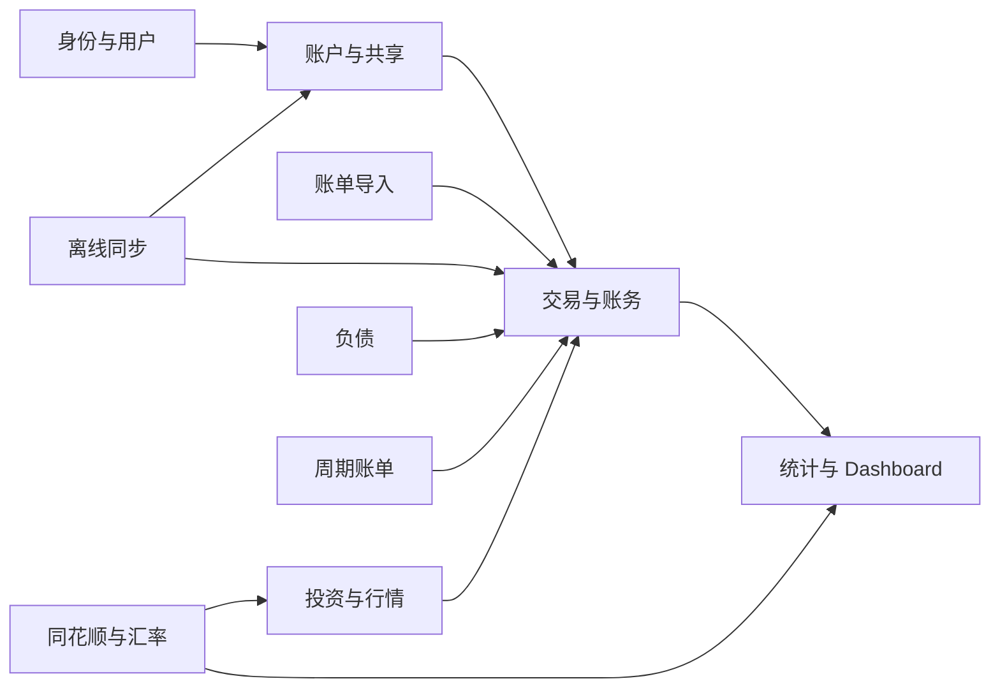
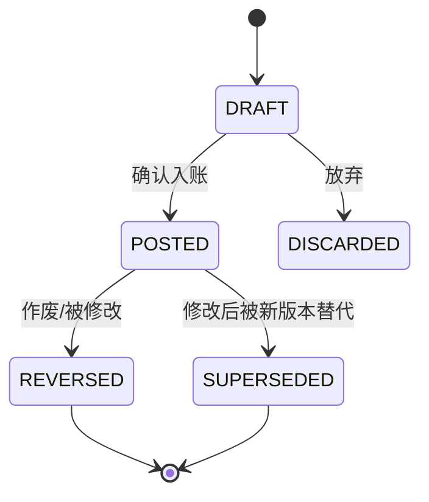

# 资迹 Ziji — 核心领域与账务设计

**文档版本：** V0.1  
**对应产品版本：** V0.1  
**需求基线：** PRD V0.1、RTM V0.1  
**文档状态：** V1 正式设计基线

## 1. 设计目标

本设计定义 V1 的核心领域语言、聚合边界、账务事实源、交易分录规则和统计口径。

优先保证：

1. 任意账户余额可以由有效分录重建。
2. 转账、负债、投资等事件不会被误计为普通收支。
3. 修改和作废保留完整历史证据。
4. 共享比例、价格和汇率变化不会污染账务事实。
5. 离线重试不会重复入账。

对应需求：ACC-*、LED-*、SHR-*、INV-*、LIA-*、DASH-*、FX-*、SYNC-*。

## 2. 通用语言

| 术语 | 定义 | 不包含 |
| --- | --- | --- |
| 账户 Account | 保存某类资产、负债或投资持仓的资金载体 | 收入、支出分类 |
| 交易 Transaction | 用户能够理解的一次完整业务事件 | 单条账户余额变化 |
| 分录 LedgerEntry | 交易对账务科目产生的一条借方或贷方记录 | 可独立修改的流水 |
| 科目 LedgerAccount | 复式账务中的记账对象，包含用户账户及系统对方科目 | 产品界面上的账户分类 |
| 余额 Balance | 指定时点有效分录的汇总结果 | 用户直接保存的独立事实 |
| 流水 | Transaction 的用户界面表达 | 独立于 Transaction 的领域实体 |
| 持仓 Position | 某投资账户中某金融产品的当前数量与成本状态 | 独立于投资交易的原始事实 |
| 价格快照 | 某产品在指定业务时点的收盘价或净值 | 用户成交价 |
| 基准币种 | 用户 Dashboard 的统一展示和统计币种 | 对原币账务的替代 |
| 计入比例 | 共享账户余额进入某个用户个人统计的权重 | 法律所有权比例 |
| 冲正 Reversal | 用等额反向分录抵消已确认交易 | 物理删除 |
| 业务日期 | 入账时由用户确认或按当时用户时区生成、入账后保持不变的权威账务日期 | 服务端 UTC 创建时间、用户后续时区变化 |

## 3. 限界上下文



上下文之间只通过应用服务和稳定 DTO 交互。外部数据源模型不得直接进入账务核心。

## 4. 用户聚合

### 4.1 User

职责：

- 保存用户身份、邮箱状态和个人展示设置
- 提供用户时区和基准币种
- 控制账号状态

关键不变量：

- 规范化邮箱全局唯一
- 未验证邮箱不得完成注册
- 基准币种必须属于 V1 支持列表
- 密码凭据认证仅允许 `ACTIVE`、`CLOSING`；`LOCKED`、`CLOSED` 与不存在用户、密码错误对外统一为 `INVALID_CREDENTIALS`

认证会话属于身份上下文，不进入账务计算。

### 4.2 EmailChallenge 与认证限流

`EmailChallenge` 是注册和密码重置共用的身份领域事实，`purpose` 固定为 `REGISTER` 或 `RESET_PASSWORD`，但两种用途的挑战和限流桶完全隔离。挑战生命周期为 `ACTIVE → CONSUMED | REPLACED | EXPIRED | MAX_ATTEMPTS | SECURITY_REVOKED`；`consumed_at` 与失效时间/原因不能同时存在，失效时间和失效原因必须成对出现。验证码有效期固定 10 分钟，单个挑战最多 5 次错误尝试。

发送请求只提交邮箱和可选 `deviceId`（1～200 字符）。缺失 `deviceId` 不拒绝请求，服务端使用来源 IP 与 `MISSING_DEVICE` 域标记生成设备主体摘要。设备标识是防滥用信号，不是可信身份凭据。服务端对语法合法的请求使用不区分邮箱是否存在的响应语义。

认证限流是固定窗口策略：

| 维度 | 窗口与配额 |
| --- | --- |
| EMAIL | 60 秒 1 次、1 小时 5 次、24 小时 10 次 |
| IP | 10 分钟 20 次、24 小时 100 次 |
| DEVICE | 1 小时 10 次、24 小时 30 次 |

每个桶保存用途、维度、HMAC-SHA-256 32 字节主体摘要、密钥版本、策略/窗口标识、窗口边界、请求数和阻塞截止时间。主体规范化后按用途、维度和主体做域分离 HMAC；限流桶不得保存原始 IP、邮箱或设备标识。密钥轮换期间同一请求同时识别并占用当前及上一版本摘要，上一版本至少保留 48 小时。窗口结束或 `blocked_until` 后的桶继续保留 7 天，再由清理任务删除。

同一请求涉及的 IP、邮箱、设备及其所有窗口必须在 PostgreSQL 一个事务内按固定顺序原子占用，禁止先查后写。实现固定使用 `IP → EMAIL → DEVICE` 的维度顺序，并在每个维度内按窗口时长从短到长、密钥版本从小到大处理。任一窗口超限时返回 429，`Retry-After` 使用所有超限窗口中最长剩余时间；即使拒绝，也提交所有已增加的请求计数。通过限流后，应用在同一事务内先将同邮箱同用途的旧活动挑战标记为 `REPLACED`，再写入新挑战和邮件投递事件；部分唯一索引保证至多一个活动挑战，任一步失败均整体回滚，因此事务提交后旧挑战替换和新挑战投递事实同时可见。邮件投递失败不退还限流次数，outbox 重试同一挑战，不重新生成验证码；若敏感验证码进入 outbox，必须是应用层信封加密载荷。

密码登录复用同一 PostgreSQL 桶表但不复用验证码 HMAC 域：作用域固定为 `LOGIN_PASSWORD/LOGIN/AUTH_LOGIN_V1`，按 `IP(10m/30、24h/300) → EMAIL(15m/10、24h/50)` 原子占用，禁止 DEVICE 桶。所有语法合法请求都增加全部桶计数，超限仍提交并按最长剩余时间返回 429。凭据认证对不存在邮箱使用进程启动时生成并复用的同参数 Argon2id dummy Hash；已存在用户无论状态也执行一次校验，随后才合并密码和状态结果。此领域规则不创建会话，也不改变 `User.status`。

### 4.3 DeviceSession 与 RefreshToken

`DeviceSession` 是身份上下文中的稳定设备会话，不进入账务事实。登录成功始终创建新 `sessionId`；同一用户以同一非空 `deviceId` 再次登录时，在同一事务先以 `REPLACED_BY_LOGIN` 撤销旧活动会话及刷新 Token，再创建新会话。缺失 `deviceId` 时不进行替换。`deviceName` 经过 NFKC、trim 后为 1～100 字符；`deviceId` 是不透明稳定标识，保留客户端原值，非空时为 1～200 字符且不得全空白，不做 NFKC 或 trim。

会话与刷新 Token 固定 30 天绝对有效，刷新不改变 `sessionId` 或会话到期。刷新 Token 的 `createdAt` 固定等于 `issuedAt`，且必须早于到期；原文仅交付客户端一次，格式为 `rt1_` 加 32 字节 SecureRandom 无填充 Base64URL；持久化仅保存 `v1:` 加域分离 SHA-256 摘要。正常轮换在一个 PostgreSQL 事务内持有当前 Token 行锁，消费旧 Token、插入同会话同到期的新 Token、设置 `replacedById` 并更新 `lastSeenAt`；任一步失败整体回滚，且同一 Token 并发最多一方成功。旧 Token 消费历史保留用于后续重用攻击处理。

Access Token 是只在边界交付的 RS256 JWT：`typ=at+jwt`、受控 `kid`、`iss=ziji-backend`、`aud=ziji-api`、`sub`、`sid`、`jti`、`iat`、`nbf`、`exp` 均为必填；有效期为 30 分钟，时钟偏差最多 60 秒且不超过会话到期。Access Token、原始刷新 Token 和签名私钥不得进入数据库、日志、异常、审计 metadata、outbox 或幂等记录。

## 5. Account 聚合

### 5.1 Account

关键属性：

```text
id
account_class: ASSET | INVESTMENT | LIABILITY
account_type: BANK | WECHAT | ALIPAY | CASH | BROKERAGE | FUND | CREDIT_CARD | LOAN | CONSUMER_LOAN | OTHER
name
institution
currency
status: ACTIVE | ARCHIVED
version
created_at / updated_at
```

合法 class/type 矩阵固定为：

| account_class | 允许的 account_type |
| --- | --- |
| ASSET | BANK、WECHAT、ALIPAY、CASH、OTHER |
| INVESTMENT | BROKERAGE、FUND、OTHER |
| LIABILITY | CREDIT_CARD、LOAN、CONSUMER_LOAN、OTHER |

`FUND` 只表示基金账户，`CONSUMER_LOAN` 只表示消费贷款。`OTHER` 只表示对应大类的“其他”，不得代替这两类产品子类型。既有 `OTHER` 行保持 `OTHER`，不回填。

### 5.2 账户与账务科目

每个 Account 对应一个用户可见账务科目：

- 资产账户：借方余额为正
- 负债账户：贷方余额为正
- 投资账户包含现金结算关系和持仓子账，不直接把持仓数量当金额余额

系统内部还维护用户不可直接操作的对方科目：

- `EQUITY_OPENING_BALANCE`：期初权益
- `INCOME_*`：收入科目
- `EXPENSE_*`：支出科目
- `EQUITY_BALANCE_ADJUSTMENT`：余额调整
- `FX_CLEARING`：跨币种清算
- `INVESTMENT_CLEARING`：投资交易清算

Ledger 的外部 application interface 只接收当前用户、客户端 Transaction UUID（仅初次创建）和交易语义字段；不得接收 `LedgerAccountId`、账务方向、分录或系统科目 code。收入/支出在验证账户写权限、分类、币种和语义后，由 Ledger 内部按 `(actingUserId, categoryId, nature, currency)` 读取或在同一账务事务内惰性确保系统对方科目：code 固定为 `INCOME_CATEGORY_<categoryUuid>` 或 `EXPENSE_CATEGORY_<categoryUuid>`，`ledger_role=SYSTEM`、`owner_user_id=actingUserId`。既有 `(owner_user_id, code, currency)` 唯一约束解决并发；调用方不得看见或指定该科目。

退款必须关联原支出，分类、支出对方科目和可退款余额均从原支出事实继承；修订退款也不得用 replacement 覆盖原支出分类。Sync 的业务时间、业务日期和时区在入队时必须显式确认，服务端校验其合法性后保持该历史归属，不使用同步时的当前用户时区重分日。B1 Sync 转账只允许同币种、同金额，手续费为零时没有费用分类、手续费大于零时以费用分类惰性确保支出系统科目；跨币种和汇率转换不由该接口生成。

Account 与 LedgerAccount 的关系固定为：

- ASSET：一个 `PRIMARY` 主金额科目
- LIABILITY：一个 `PRIMARY` 主金额科目
- INVESTMENT：一个 `PRIMARY` 券商现金科目和一个 `POSITION_COST` 内部持仓成本科目
- 系统收入、支出、权益和清算科目不对应用户可见 Account

投资账户只支持账户币种这一种结算币种；多币种券商账户在 V1 中按币种创建多个投资账户。投资账户的资产价值为 `PRIMARY` 券商现金余额加持仓市值；`POSITION_COST` 只用于账务平衡和成本对账，不再次计入资产总额，避免与持仓市值重复计算。

账户创建的可选期初余额只创建内部 `OPENING` 交易，不能由普通交易创建入口调用。`openingBalance` 缺失或为 `null` 时不创建交易；存在时必须是账户币种入账精度内的正数。分录固定为：

| account_class | 借方 | 贷方 | 额外边界 |
| --- | --- | --- | --- |
| ASSET | 账户 `PRIMARY` | `EQUITY_OPENING_BALANCE` | 不计收入或支出 |
| INVESTMENT | 账户 `PRIMARY` | `EQUITY_OPENING_BALANCE` | 仅期初现金；禁止写 `POSITION_COST`，不创建持仓 |
| LIABILITY | `EQUITY_OPENING_BALANCE` | 账户 `PRIMARY` | 正数表示已有债务；不计收入或支出 |

`businessDate` 和持久化时区由 `businessAt` 按当前用户 IANA 时区派生，入账后固定。账户创建响应仅在该 `OPENING` 交易成功入账时返回其 UUID；没有期初余额时返回 `null`。

投资成交仅使用投资账户自身的 `PRIMARY` 券商现金科目结算。外部银行卡和投资账户之间的入金、出金属于普通转账；投资成交命令不得跳过该转账直接改变任意外部现金账户。

### 5.3 账户成员统一模型

所有 Account 均通过 AccountMember 授权，包括只有创建者一人的账户。创建 Account 时在同一事务中创建：

```text
Account
→ 创建者的 ACTIVE OWNER membership 周期
→ 该 membership 的 included=true、ratio=1.000000 计入设置
→ 账户所需 LedgerAccount
```

`Account.created_by` 只用于审计，不能替代 ACTIVE AccountMember 权限判断。

### 5.4 LiabilityDetail

负债详情是账户下的独立可选资源，不嵌入 Account，也不随账户创建。账户合法存在但尚无 `liability_details` 行时，读取投影返回六个业务字段均为 `null`、`version=0` 的虚拟空详情和强 ETag `"0"`；持久化详情从 `version=1` 开始。虚拟空详情只能通过 `If-None-Match: *` 的首次完整写入创建，不能用 `If-Match: "0"` 创建。V1 不删除详情行，清空字段使用 PATCH `null`。

字段为：

```text
interest_rate
loan_date
due_date
billing_day
repayment_day
current_amount_due
```

`interest_rate` 是 0～1、最多 8 位小数的年化比例；`loan_date` 与 `due_date` 同时存在时后者不得早于前者。`billing_day`、`repayment_day` 是 1～31 的名义日，短月取月末，只驱动提醒，不改变交易业务日期。`current_amount_due` 使用账户币种精度，只用于提醒，不是账务余额事实。V1 不自动计提未支付利息和费用；只有正式分录参与负债余额。复杂分期、最低还款、罚息和应计利息自动计算不属于 V1。

字段矩阵固定为：

| account_type | 允许字段 | 禁止字段 |
| --- | --- | --- |
| CREDIT_CARD | interest_rate、billing_day、repayment_day、current_amount_due | loan_date、due_date |
| LOAN / CONSUMER_LOAN | interest_rate、loan_date、due_date、repayment_day、current_amount_due | billing_day |
| OTHER | 全部字段 | — |

详情独立使用乐观版本，不推进 Account.version。当前 ACTIVE membership 的三种角色可读，OWNER/EDITOR 可写；VIEWER 写入拒绝。账户不可见、membership 已失效、仅 created_by 命中或账户不是 LIABILITY 时统一按资源不存在处理。

### 5.5 状态规则

- 新账户状态为 ACTIVE
- 有历史账务的账户不得删除
- ARCHIVED 账户不允许新增普通交易，但允许必要的冲正和审计修复
- 非零余额归档需要用户显式确认

## 6. Transaction 聚合与复式账务

### 6.1 聚合结构

```text
Transaction (聚合根)
├── LedgerEntry 1..n
├── TransactionVersion 0..n
├── ReversalRelation 0..1
└── TransactionTags 0..n
```

Transaction 负责保证所有 LedgerEntry 原子提交和业务规则一致。

### 6.2 Transaction 状态



交易一旦成功入账，其分录就是不可变账务事实。余额汇总包含所有已经入账的原交易分录和冲正交易分录；两者通过方向相反的分录相互抵消。

`REVERSED` 和 `SUPERSEDED` 表示原交易的业务状态，不表示从账本查询中删除原分录。只有从未入账的 `DRAFT` 和 `DISCARDED` 不参与账本汇总。

### 6.3 分录结构

每条 LedgerEntry 至少包含：

```text
transaction_id
ledger_account_id
currency
direction: DEBIT | CREDIT
amount > 0
business_date
sequence_no
```

数据库存储金额绝对值和借贷方向，禁止同时使用正负号与方向表达同一含义。

### 6.4 平衡规则

对每笔交易、每个币种分别满足：

```text
Σ Debit(amount) = Σ Credit(amount)
```

跨币种交易在各币种内通过 `FX_CLEARING` 科目分别平衡，并在 Transaction 上保存两端原币金额和成交汇率。

平衡检查必须在领域服务和数据库提交边界执行。数据库无法用普通 CHECK 跨行校验时，由延迟约束触发器或受控存储过程在事务提交前校验。

### 6.5 精度和舍入

- 金额：`NUMERIC(24,8)`
- 数量、价格、汇率：`NUMERIC(28,12)`
- 领域计算使用 BigDecimal
- 禁止从二进制浮点构造财务值
- CNY、USD、HKD、EUR 的货币最小单位为 2 位小数，JPY 为 0 位小数
- LedgerEntry、费用、税费和实际成交金额在入账时按币种最小单位使用 `HALF_UP` 舍入
- 输入金额超过币种入账精度时必须拒绝或要求用户明确确认舍入，不能静默处理
- 数量、价格和汇率最多保留 12 位小数，中间乘除不反复舍入
- 持仓成本保留 8 位小数，平均成本保留 12 位小数；全部卖出时释放全部剩余成本
- 估值和汇率折算先按允许精度聚合，最终在快照/API 输出边界按展示币种最小单位舍入一次
- 收益率和比例保留 6 位小数
- 平衡校验使用入账后的精确金额，不接受容差平衡

### 6.6 余额计算

资产科目：

```text
余额 = Σ借方金额 - Σ贷方金额
```

负债、收入、权益科目：

```text
余额 = Σ贷方金额 - Σ借方金额
```

账户余额缓存仅为投影。缓存重建流程：

```text
读取目标时点前所有已入账 LedgerEntry（包含原交易和冲正交易）
→ 按 ledger_account 和 currency 汇总
→ 写入余额快照
→ 对比原缓存并记录差异
```

`GET /accounts/{accountId}/balance` 的账面余额读取使用一个共同的精确 `asOf`：缺失参数时在同一只读一致性读取边界内仅捕获一次服务端 Clock，显式参数必须解析为带 UTC offset 的 ISO 8601 instant，并在响应中规范化为 UTC。账面余额只汇总目标账户 `PRIMARY` 科目的已入账分录；筛选交易固化的 `business_date <= LocalDate(asOf at transaction.timezone)`，包含已入账的原交易、冲正交易和替代事实，不能因当前交易版本状态排除历史分录。无分录返回账户币种精度的零；PRIMARY 缺失、币种不一致或历史事实损坏必须 fail closed，不能以零或一替代。

### 6.7 可用余额

冻结、在途和预留金额不生成 LedgerEntry，因为它们不改变资产所有权；它们作为可审计的 `LiquidityHold` 流动性事实保存。

```text
activeUnavailableAmount(t) = Σ 在 t 时点有效的 FROZEN / IN_TRANSIT / RESERVED hold
availableBalance(t) = ledgerBalance(t) - activeUnavailableAmount(t)
```

可用余额可由账务分录和 LiquidityHold 完整重建。直接覆盖 `availableBalance` 或 `frozenAmount` 均不允许。负可用余额必须原样保留，余额响应使用 `liquidityStatus=NEGATIVE_AVAILABLE`；`NORMAL` 仅表示可用余额大于或等于零，投影新鲜度不能混入这两个流动性数学状态。

LiquidityHold 的机器类型固定为 `FROZEN`、`IN_TRANSIT`、`RESERVED`。类型属于每个版本的业务事实，修订可以改变类型，但必须在修订载荷中显式提交新类型；不能从旧版本隐式继承或由客户端提交数据库字段名。公共人工 API 的 `source` 固定为 `MANUAL`，`IMPORT` 和 `SYSTEM` 仅供受控内部路径。公共 `reason` 映射 `liquidity_holds.note`，修订理由使用新版本的 `reason`，并由审计 action `LIQUIDITY_HOLD_REVISED` 表示，不引入没有持久化归宿的 `revisionReason`。

每次查询和写入按请求时点 `asOf` 判断有效性：

```text
effective_at <= asOf
AND (ended_at IS NULL OR ended_at > asOf)
AND (expires_at IS NULL OR expires_at > asOf)
```

`PENDING` 表示未来 `effective_at` 且尚未终止；`ACTIVE` 表示已生效且满足有效条件；`RELEASED`、`SUPERSEDED` 分别对应人工释放和修订关闭；`EXPIRED` 对应 `end_reason=EXPIRED`，或在最终化任务尚未运行时由 `expires_at <= asOf` 推导出的逻辑过期。到达 `expires_at` 即过期，过期记录不能再释放或修订。最终化任务将 `ended_at` 固定写为 `expires_at`、设置 `end_reason=EXPIRED` 并递增版本。

余额端点在相同 `asOf` 将每个有效 LiquidityHold 版本按其自身 `hold_type` 分别汇总为 frozen、inTransit、reserved，再计算 `unavailableAmount = frozen + inTransit + reserved` 与 `availableBalance = ledgerBalance - unavailableAmount`。Ledger、LiquidityHold 和授权可见性必须来自同一个 PostgreSQL 一致性读取快照；不能把旧投影包装为任一流动性状态。当前没有全局余额事实 sequence 时，响应 `asOfSequence` 固定为哨兵 `0`，表示完整事实读取或重建结果，而不是第 0 条业务变更。

生命周期终止采用当前版本条件和数据库事务串行化。手工释放/修订与 `LIQUIDITY_HOLD_EXPIRY_FINALIZER` 竞争时，先成功关闭当前版本的一方获胜；旧 ETag 的并发请求返回 `VERSION_CONFLICT`，重新读取后已过期的版本返回业务规则错误。完整修订历史按 `created_at DESC, id DESC` 返回，分页游标必须是不透明 keyset 游标并绑定账户、过滤条件和排序定义。

## 7. 修改、作废和冲正

### 7.1 修改已确认交易

```text
原 Transaction V1（POSTED）
→ 创建冲正 Transaction R1
→ 原 Transaction 标记 SUPERSEDED
→ 创建新 Transaction V2（POSTED）
```

R1 的每条分录与 V1 对应分录金额相同、借贷方向相反。

### 7.2 作废已确认交易

```text
原 Transaction（POSTED）
→ 创建冲正 Transaction
→ 原 Transaction 标记 REVERSED
```

### 7.3 限制

- 冲正交易不可单独修改
- 修改和作废必须保存操作者、原因和时间
- 关联退款、投资卖出或后续冲正的交易，修改前必须做影响检查
- 已同步交易禁止通过数据库物理删除

### 7.4 Ledger 审计事实

Ledger 只能经 `audit.application.AuditLogWritePort` 追加审计事实，不得访问 audit infrastructure、
jOOQ 或 `audit_logs`。所有 Ledger 审计动作、资源类型和原因码使用大写下划线 machine code：

| 业务转换 | action | resourceType / resourceId | result / reasonCode | 关联事实 |
| --- | --- | --- | --- | --- |
| 初次入账 | `TRANSACTION_POSTED` | `TRANSACTION` / 当前 Transaction 的 `root_transaction_id`；初次入账时等于当前 Transaction ID | `SUCCESS` / NULL | 当前 Transaction、其 `version_no`、`entity_version`、`source` |
| 已确认交易修订 | `TRANSACTION_REVISED` | `TRANSACTION` / 被修订原版本的 `root_transaction_id`，不是冲正 Transaction 自己的 root | `SUCCESS` / `SUPERSEDED` | 原版本、冲正 Transaction、替代 Transaction、原/替代版本号和实体版本 |
| 已确认交易作废 | `TRANSACTION_VOIDED` | `TRANSACTION` / 被作废原版本的 `root_transaction_id`，不是冲正 Transaction 自己的 root | `SUCCESS` / `REVERSED` | 原版本、冲正 Transaction、原版本号和作废后的实体版本 |

`accountId` 仅在该次转换恰好涉及一个可见账户时填写其账户 ID；转账等多账户交易、没有唯一可见账户的系统
科目交易均填写 NULL，不能任选一个账户造成错误归属。实际用户命令使用 `USER` 和非空 `actorUserId`；受控
系统任务使用 `SYSTEM` 和空 `actorUserId`。`source` 是交易来源，不得替代 audit actor。此写入链只追加
已成功提交的业务事实，故 `result` 固定为 `SUCCESS`；`DENIED` 或 `FAILED` 不属于这三种 Ledger 事实写入
的成功提交路径，不能用失败审计代替或补写成功事实。

`requestId` 只保存当前受控 HTTP 请求或系统任务的 requestId / correlation ID，不能由 `transactionId`、
`rootTransactionId`、`outboxEventId`、`clientOperationId`、Idempotency-Key 或任意业务资源 ID 代替；它遵守
audit port 的长度、非空白和非控制字符边界，不得保存原始请求头、凭据或完整载荷。metadata 最多 16 个键，键使用 ASCII camelCase/数字，值为 UUID 字符串、十进制整数或
已冻结枚举字符串，并遵守公开 port 的键长 64、值长 160 Unicode code point 边界。允许键固定如下：

| action | 必填 metadata 键 | 条件键 |
| --- | --- | --- |
| `TRANSACTION_POSTED` | `transactionId`、`rootTransactionId`、`versionNo`、`entityVersion`、`source` | `clientOperationId`：仅当当前 Transaction 事实已有该 ID |
| `TRANSACTION_REVISED` | `rootTransactionId`、`originalTransactionId`、`reversalTransactionId`、`replacementTransactionId`、`originalVersionNo`、`replacementVersionNo`、`originalEntityVersionBefore`、`originalEntityVersionAfter`、`replacementEntityVersion`、`reversalEntityVersion`、`source` | `clientOperationId`：仅当替代 Transaction 事实已有该 ID |
| `TRANSACTION_VOIDED` | `rootTransactionId`、`originalTransactionId`、`reversalTransactionId`、`originalVersionNo`、`originalEntityVersionBefore`、`originalEntityVersionAfter`、`reversalEntityVersion`、`source` | `clientOperationId`：仅当冲正 Transaction 事实已有该 ID |

修改或作废的原因文本只写入冲正 Transaction 的 `note`；修订替代版本的业务备注只写入替代 Transaction 的
`note`。metadata 不得包含 reason/note 文本、金额、分录、完整 Transaction、完整请求、SQL、Token、密码、
Cookie、密钥、验证码或 Idempotency-Key；不通过将敏感信息编码进其他 metadata 键绕过该限制。

`originalEntityVersionBefore` 是被修订或被作废、仍为 `POSTED` 的原 Transaction 在状态迁移前持久化的
`entity_version`，等于本次乐观锁预期值；`originalEntityVersionAfter` 是同一原 Transaction 迁移至
`SUPERSEDED` 或 `REVERSED` 后持久化的 `entity_version`，固定为前者加 1。
`replacementEntityVersion` 与 `reversalEntityVersion` 分别是替代 Transaction、冲正 Transaction 已确认写入后的
持久化 `entity_version`；`TRANSACTION_POSTED` metadata 的 `entityVersion` 是当前初次入账 Transaction 已确认写入后的
持久化 `entity_version`。三种 action 的 metadata 均不超过 16 键。

## 8. 标准账务样例

以下样例均以 CNY 为例。`借`和`贷`表示复式账务方向，不等同于资产增减符号。

### 8.1 期初余额 ¥10,000

| 借方 | 贷方 | 金额 |
| --- | --- | ---: |
| 银行卡资产 | 期初权益 | 10,000 |

结果：资产 +10,000；收入 0；净资产 +10,000。

该样例是资产账户方向。负债账户的正债务期初余额使用相反方向：借 `EQUITY_OPENING_BALANCE`、贷负债 `PRIMARY`，使负债增加且净资产减少。投资账户只允许同资产方向登记 `PRIMARY` 期初现金，不得以 `OPENING` 写入 `POSITION_COST` 或伪造持仓。

### 8.2 工资收入 ¥8,000

| 借方 | 贷方 | 金额 |
| --- | --- | ---: |
| 银行卡资产 | 工资收入 | 8,000 |

结果：资产 +8,000；收入 +8,000；净资产 +8,000。

### 8.3 现金支付餐饮 ¥50

| 借方 | 贷方 | 金额 |
| --- | --- | ---: |
| 餐饮支出 | 现金资产 | 50 |

结果：资产 -50；支出 +50；净资产 -50。

### 8.4 原餐饮退款 ¥20

| 借方 | 贷方 | 金额 |
| --- | --- | ---: |
| 现金资产 | 餐饮支出 | 20 |

结果：资产 +20；餐饮净支出 -20；普通收入 0。

### 8.5 银行卡转支付宝 ¥1,000

| 借方 | 贷方 | 金额 |
| --- | --- | ---: |
| 支付宝资产 | 银行卡资产 | 1,000 |

结果：资产总额 0 变化；收支 0。

### 8.6 CNY 700 转入 USD 100，实际汇率 7.0

CNY 分录：

| 借方 | 贷方 | 金额 |
| --- | --- | ---: |
| FX 清算-CNY | 银行卡-CNY | 700 CNY |

USD 分录：

| 借方 | 贷方 | 金额 |
| --- | --- | ---: |
| 银行卡-USD | FX 清算-USD | 100 USD |

结果：原币分别平衡；交易保存两端金额和实际汇率。基准币资产变化只来自手续费或实际汇兑差额。

### 8.7 信用卡消费 ¥300

公共命令使用 `EXPENSE`，但 accountId 必须指向当前用户可写的 CREDIT_CARD。Ledger 根据账户性质生成借费用/分类科目、贷信用卡 `PRIMARY` 的分录；HTTP 或 Liability 模块不得自行提交内部科目或分录。

| 借方 | 贷方 | 金额 |
| --- | --- | ---: |
| 购物支出 | 信用卡负债 | 300 |

结果：负债 +300；支出 +300；净资产 -300。

### 8.8 信用卡还本金 ¥300

| 借方 | 贷方 | 金额 |
| --- | --- | ---: |
| 信用卡负债 | 银行卡资产 | 300 |

结果：资产 -300；负债 -300；净资产 0 变化；支出 0。

### 8.9 借款到账 ¥10,000

公共命令使用 `LIABILITY_BORROWING`，字段为收款资产账户、负债账户、同一币种和正数金额。它是独立业务命令，内部固定持久化为 `TransactionType.TRANSFER`，方向为借资产 `PRIMARY`、贷负债 `PRIMARY`，不计收入。

| 借方 | 贷方 | 金额 |
| --- | --- | ---: |
| 银行卡资产 | 借款负债 | 10,000 |

结果：资产和负债各 +10,000；净资产及收入 0 变化。

### 8.10 还本金 ¥1,000、利息 ¥50

公共 API 使用 `LIABILITY_REPAYMENT` 表示该语义命令；进入 Ledger 后固定映射为内部 `TransactionType.REPAYMENT`，与数据库 `transactions.transaction_type=REPAYMENT` 保持一致。

本金、利息和手续费必须与付款资产、负债账户使用同一币种；本金为正数，利息和手续费为非负数。利息或手续费大于 0 时必须提交相应费用分类，等于 0 时相应分类必须为 `null`。整个命令在一个账务事务中平衡并原子提交。

| 借方 | 贷方 | 金额 |
| --- | --- | ---: |
| 借款负债 | 银行卡资产 | 1,000 |
| 利息支出 | 银行卡资产 | 50 |

结果：资产 -1,050；负债 -1,000；支出 +50；净资产 -50。

### 8.11 买入股票 100 股 × ¥10，手续费 ¥5

金额账：

| 借方 | 贷方 | 金额 |
| --- | --- | ---: |
| 投资清算/投资成本 | 银行卡资产 | 1,000 |
| 投资手续费支出 | 银行卡资产 | 5 |

持仓账：数量 +100；成本基础 +1,000。手续费在 V1 作为支出，不再重复加入持仓成本。

结果：资产因手续费减少 5；投资本金转换资产形态；支出 +5。

### 8.12 卖出 40 股 × ¥12，手续费 ¥3

假设移动平均成本为 ¥10/股：

```text
卖出收入 = 480
释放成本 = 400
已实现毛收益 = 80
手续费 = 3
已实现净收益 = 77
```

金额账：

| 借方 | 贷方 | 金额 |
| --- | --- | ---: |
| 银行卡资产 | 投资清算/投资成本 | 400 |
| 银行卡资产 | 已实现投资收益 | 80 |
| 投资手续费支出 | 银行卡资产 | 3 |

持仓账：数量 -40；成本基础 -400。

### 8.13 分红 ¥100

| 借方 | 贷方 | 金额 |
| --- | --- | ---: |
| 银行卡资产 | 分红收入 | 100 |

结果：资产 +100；投资收益和收入 +100。

### 8.14 余额上调 ¥30

| 借方 | 贷方 | 金额 |
| --- | --- | ---: |
| 现金资产 | 余额调整权益 | 30 |

结果：资产和净资产 +30；普通收入 0；资产变化归因为余额调整。

## 9. Dashboard 统计领域

### 9.1 当前指标

对用户 `u`、时点 `t`、基准币种 `b`：

```text
个人账户金额 = 账户原币余额(t)
             × 历史生效计入标记(u, account, t)
             × 历史生效计入比例(u, account, t)
             × 汇率(account.currency → b, t)
```

```text
资产总额 = 普通资产账户金额 + 投资账户 PRIMARY 现金金额 + 投资持仓市值
投资资产 = 投资账户 PRIMARY 现金金额 + 投资持仓市值
可用资金 = 普通 ASSET 账户可用余额
负债总额 = 负债个人账户金额
净资产 = 资产总额 - 负债总额
```

### 9.2 资产变化归因

同一统计周期的变化拆分：

```text
期末净资产 - 期初净资产
= 净收支影响
+ 投资价格影响
+ 汇率影响
+ 余额调整影响
+ 计入范围/比例影响
```

各归因项必须能够下钻到交易、价格、汇率或设置变更记录。

### 9.3 历史稳定性

- 历史报表使用当时生效的计入设置
- 历史价格和汇率修正形成新版本，不覆盖旧事实
- 修正后自动重算受影响业务日期、相邻变化归因以及月/年汇总，默认展示最新修正结果
- 旧统计版本保留用于审计；响应展示 `valuationRevision` 和 `recalculatedAt`
- 当前值与历史值都应显示数据截至时间

### 9.4 总资产变化日历

总资产变化日历是 `daily_user_asset_snapshots` 的版本化展示，不是新的账务事实，也不是投资收益。统计指标固定为：

```text
TOTAL_ASSETS  当日总资产变化 = end_total_assets - begin_total_assets
NET_ASSETS    当日净资产变化 = end_net_assets - begin_net_assets
```

`begin_*` 使用用户时区下上一自然日的有效日终快照，`end_*` 使用当前自然日日终快照；两端必须使用同一基准币种与同一已发布 `valuationRevision`。变化率为变化金额除以对应日初值，日初值小于或等于 0 时返回 null。该变化率只表示资产规模变化，不得命名为投资收益率。

日期明细必须同时满足：

```text
total_asset_change = end_total_assets - begin_total_assets
liability_change   = end_total_liabilities - begin_total_liabilities
net_asset_change   = total_asset_change - liability_change
```

总资产变化按资产账户余额与投资持仓贡献下钻，并进一步标记收入、支出、借款/还款本金、投资价格、汇率、调整和计入设置等来源。净资产归因继续遵守 §9.2。两个均计入范围的账户间转账贡献为 0；跨计入边界的转账只影响实际进入或离开统计范围的一侧。

日期状态为 `CALCULATED | NO_ASSETS | PENDING_DATA | PARTIAL | UNAVAILABLE`。`TOTAL_ASSETS` 没有计入资产时为 `NO_ASSETS`；`NET_ASSETS` 只有在资产和负债都未计入时才为 `NO_ASSETS`，仅有负债时仍须正常计算负的净资产及其变化。只有完整计算可以返回变化金额；`CALCULATED + 0` 表示真实零变化，周末不能自动映射为无数据。`PARTIAL/UNAVAILABLE` 不返回完整变化金额。历史事实或估值修订时重算受影响日期、其后依赖该日作为日初的相邻日期和月份汇总，并发布新的 `valuationRevision`。

## 10. 共享账户领域规则

### 10.1 AccountMember

```text
role: OWNER | EDITOR | VIEWER
status: ACTIVE | LEFT | REMOVED
```

邀请不是 AccountMember 状态。邀请由 `AccountInvitation` 独立建模，状态为 `PENDING | ACCEPTED | REJECTED | REVOKED | EXPIRED`；只有接受邀请后才创建新的 ACTIVE AccountMember。

不变量：

- 每个账户至少一个 ACTIVE OWNER
- 只有 OWNER 可以管理成员和账户资料
- 每个用户只能修改自己的统计设置
- 成员退出或移除后，其审计主体仍保留
- 同一用户再次加入同一账户时创建新的 membership 周期，不复用历史成员行
- 成员周期结束时关闭该 membership 下当前生效的计入设置

### 10.2 AccountInclusionSetting

采用有效时间模型：

```text
membership_id
included
ratio [0,1]
valid_from
valid_to nullable
```

新设置生效时关闭同一 membership 的旧记录 `valid_to`，禁止覆盖旧记录。相邻区间不得重叠。创建者初始设置为 100%；被邀请用户每次加入生成新的 membership 和默认 0% 设置，不继承上一成员周期。

## 11. 投资领域

### 11.1 Instrument

核心 Instrument 不依赖同花顺：

```text
id
type: STOCK | FUND | ETF | OTHER
name
market
currency
status
```

外部代码由 InstrumentSourceMapping 保存：

```text
instrument_id
source: TUSHARE | MANUAL
external_code
```

### 11.2 Trade

Trade 是投资交易的结构化明细，必须关联一个 Transaction：

```text
side: BUY | SELL | DIVIDEND
quantity
unit_price
gross_amount
fee_amount
tax_amount
trade_at
```

Transaction 是金额账事实，Trade 是持仓数量和成本事实。两者必须原子写入。

V1 投资手续费和税费统一计入投资费用科目，不进入 `POSITION_COST` 和持仓成本。买入成本基础只包含实际买入成交金额；卖出手续费和税费从已实现收益中扣减，买入侧费用在发生时计入累计投资费用。

### 11.3 持仓计算

按投资账户和 Instrument 顺序处理当前业务状态为 `POSTED` 的 Trade。父交易为 `REVERSED` 或 `SUPERSEDED` 的原 Trade 不参与持仓重建；对应冲正 Transaction 只冲正金额分录，不创建一笔会被误认为正常买卖的 Trade。修改后的新 Transaction 创建新的 `POSTED` Trade。

买入：

```text
新数量 = 旧数量 + 买入数量
新成本 = 旧成本 + 买入成交金额
新平均成本 = 新成本 / 新数量
```

卖出：

```text
卖出成本 = 卖出数量 × 卖出前平均成本
新数量 = 旧数量 - 卖出数量
新成本 = 旧成本 - 卖出成本
```

不允许卖出后数量小于 0，除非未来明确支持做空。

### 11.4 估值

- 股票：最新有效未复权收盘价 × 数量
- 场内 ETF：最新有效场内收盘价 × 数量
- 场外基金：最新公布单位净值 × 份额
- OTHER：用户最新有效手工价格 × 数量

缺失价格时状态为 `UNPRICED`，不得按 0 估值。Dashboard 需要展示未估值资产提示，并分别提供“已估值资产小计”和数据质量状态。

### 11.5 收益

```text
已实现收益 = Σ卖出成交金额 - Σ对应移动平均成本 - Σ卖出手续费税费
未实现收益 = 当前市值 - 剩余持仓成本
累计收益 = 已实现收益 + 未实现收益 + 分红 - Σ买入侧及其他尚未在已实现收益中扣减的投资费用
```

任何手续费或税费只能在上述收益口径中扣减一次。Dashboard 的普通支出统计仍在费用实际发生时展示这些投资费用。

XIRR 仅使用投资组合边界外的现金流；投资账户内部买卖不重复计入。

### 11.6 日收益与收益日历

收益日历是可重建统计投影，不是新的账务事实。统计范围 `scope` 固定为：

```text
PORTFOLIO                         当前用户全部计入统计的投资资产
INSTRUMENT(instrument_id)         当前用户跨账户合并的单一股票/基金/ETF
```

日界线使用用户时区的自然日；估值使用该日期最新有效的价格/净值和历史汇率，并应用该日生效的 membership 计入设置。全部投资日收益：

```text
portfolio_daily_profit
= end_investment_value
- begin_investment_value
- external_cash_flow
```

`investment_value` 包含投资账户 `PRIMARY` 券商现金与持仓市值。投资组合外部现金流只包含普通资金账户与投资账户之间的转入/转出；内部买卖、分红在券商现金与持仓之间的变化、以及投资费用分录不作为组合边界现金流，因此不会把本金变化误算为收益，费用会通过日终资产减少体现一次。

单一标的日收益：

```text
instrument_daily_profit
= end_market_value
- begin_market_value
- instrument_net_cash_flow
```

标的现金流使用投资者视角：买入成交金额、买入手续费和税费为正现金流；卖出净回款和分红为负现金流。若卖出回款为 `gross_amount - fee_amount - tax_amount`，则相关费用不得再额外扣除。该规则确保买卖本金不构成收益且费用只扣减一次。

日收益率使用 Modified Dietz：

```text
daily_return_rate
= daily_profit
/ (begin_value + Σ(cash_flow_i × remaining_day_weight_i))
```

`remaining_day_weight_i` 根据用户业务日内现金流发生时间计算，范围为 0～1。分母小于或等于 0 时 `daily_return_rate = null`，状态仍保留真实计算结果，不得返回伪造的 0%。

日历状态：

```text
CALCULATED       完整计算；daily_profit 可以为正、负或真实的 0
NON_TRADING_DAY  非交易日
NO_POSITION      当日范围内没有持仓或投资资产
PENDING_DATA     尚未收盘、净值待公布或投影计算中
PARTIAL          组合仅部分标的可估值，完整收益不可用
UNPRICED         统计范围无法完成期初或期末估值
```

`PARTIAL` 和 `UNPRICED` 的收益金额、收益率必须为 null，不允许基于已估值小计冒充完整收益。全部投资日历可以在选中日期后按标的返回贡献明细；贡献合计必须等于完整计算的组合日收益。历史交易、价格、净值、汇率或计入设置修订时，重算受影响日期及月份，发布新的 `valuationRevision` 并保留旧修订用于审计。

## 12. 多币种领域

### 12.1 原币优先

- 分录只保存其原始币种金额
- 不因用户修改基准币种而改写历史分录
- 折算只发生在统计投影层
- 历史报表默认按用户当前基准币种展示，每个日期使用对应历史汇率；旧基准币快照只作缓存和审计

### 12.2 ExchangeRateSnapshot

```text
base_currency
quote_currency
rate
business_at
source
fetched_at
manual_override
```

报价含义必须固定为：

```text
1 base_currency = rate × quote_currency
```

反向汇率由 BigDecimal 精确计算，禁止同时维护两份可能不一致的数据。

## 13. 周期账单

RecurringRule 只生成 `PENDING_CONFIRMATION` 候选项。

```text
到期规则
→ 生成待确认候选
→ 用户检查金额、账户和日期
→ 确认后调用普通交易应用服务
→ 生成 Transaction 和 LedgerEntry
```

周期规则本身不改变账户余额。

## 14. 领域服务

| 服务 | 职责 |
| --- | --- |
| PostingService | 创建并校验 Transaction/LedgerEntry |
| ReversalService | 修改、作废和冲正 |
| BalanceService | 余额计算、缓存重建和对账 |
| SharingPolicy | 共享角色和计入设置校验 |
| PositionService | 持仓、成本和收益计算 |
| ValuationService | 价格、净值和汇率估值 |
| DashboardService | 当前指标和变化归因 |
| SyncCommandService | 幂等、版本和冲突处理 |

领域服务不得直接调用同花顺、HTTP、移动端 SQLite 或 UI。

## 15. 领域事件

V1 在模块化单体内使用事务后领域事件，不引入 Kafka。

| 事件 | 主要订阅者 |
| --- | --- |
| TransactionPosted | 余额投影、统计投影；Ledger 写入路径同步追加审计 |
| TransactionReversed | 余额投影、持仓投影、统计投影；Ledger 写入路径同步追加审计 |
| AccountInclusionChanged | Dashboard 历史设置投影 |
| TradePosted | 持仓和收益投影 |
| PriceSnapshotUpdated | 投资估值和 Dashboard |
| ExchangeRateUpdated | 多币种估值和 Dashboard |
| ImportBatchConfirmed | 导入审计和统计投影 |
| EmailChallengeIssued | 邮件投递 outbox 和认证审计 |

事件处理必须幂等。关键账务写入与 outbox 记录在同一数据库事务完成。

Ledger 的 outbox 采用既有表的聚合命名风格：`aggregate_type` 固定为 `Transaction`；
`aggregate_id` 固定为事件所代表的新事实 Transaction ID，即 `TransactionPosted` 为初次或替代的
已确认 Transaction ID，`TransactionReversed` 为冲正 Transaction ID。`event_type` 与领域事件一一对应，
只能为 `TransactionPosted` 或 `TransactionReversed`，不另建平行 Ledger 事件名。

所有 Ledger outbox payload 的 `schemaVersion` 固定为 JSON 整数 `1`，并与表列 `payload_version=1` 一致。
`TransactionPosted` 必填 `schemaVersion`、`transactionId`、`rootTransactionId`、`versionNo`、
`entityVersion`、`operationKind`；`operationKind` 为 `INITIAL` 或 `REVISION`。`TransactionReversed` 必填
`schemaVersion`、`transactionId`（冲正 ID）、`rootTransactionId`（被冲正原版本所在业务版本链的根 ID）、
`entityVersion`（冲正 Transaction 已确认写入后的 `reversalEntityVersion`）、`reversalOfTransactionId`、
`reversalOfVersionNo`、`reversalOfEntityVersionBefore`、`reversalOfEntityVersionAfter`、`operationKind`；
`operationKind` 为 `REVISION` 或 `VOID`。修订的两类事件都额外携带同一 `replacementTransactionId`、
`replacementVersionNo`、`replacementEntityVersion`；作废事件不包含替代版本字段。字段均使用 UUID 字符串、
正整数或固定枚举，不能包含
金额、LedgerEntry、完整 Transaction、note/reason 文本、请求体、Token、密码、Cookie、密钥、SQL 或
Idempotency-Key。

`TransactionPosted.payload.entityVersion` 是该事件所指初次或替代已确认 Transaction 写入后的持久化
`entity_version`；`TransactionReversed.payload.entityVersion` 是该事件所指冲正 Transaction 写入后的持久化
`entity_version`，即 `reversalEntityVersion`。`reversalOfEntityVersionBefore`、
`reversalOfEntityVersionAfter` 分别是被冲正原 Transaction 状态迁移前、后的持久化版本；后者固定为前者加 1。

修订在同一最外层事务内以 `TransactionReversed`（冲正）后 `TransactionPosted`（替代版本）的逻辑顺序创建
outbox 记录；消费者不得依赖投递先后顺序，而应依据每条事件完整的关联字段独立处理。初次入账只有
`TransactionPosted`，作废只有 `TransactionReversed`。每个消费者都必须先按自身订阅的
`aggregate_type/event_type` 过滤，再以 `(consumerName, outboxEventId)` 建立独立持久化回执；非订阅事件不得
claim、重试、写回或标记全局状态。同一事件允许被余额、统计、持仓、同步和邮件等不同消费者分别 claim、retry、
完成或最终失败；一个消费者的 lease、attempt、retry 时间或完成状态不得改变其他消费者。

每消费者回执至少保存 `consumerName`、`outboxEventId`、生命周期状态、claim token、lease 到期时间、
`attemptCount`、`nextAttemptAt`、成功 `completedAt`、失败 `failedAt` 和安全 `errorCode`。receipt 的唯一键为
`(consumerName, outboxEventId)`，不能用 `change_log` 的业务唯一键替代。多实例同一消费者在 PostgreSQL
行锁/`SKIP LOCKED` 下只能有一个有效 claim；lease 到期后仅该消费者可以重新领取。瞬时读取或外部依赖失败进入
`FAILED_RETRYABLE` 并按该消费者自己的退避时间重试；事件 schema、aggregate、目标 Transaction 或版本关系不一致
进入 `FAILED_FINAL`，保留安全错误码并告警，不产生错误投影或变更记录。

每个消费者的订阅义务由 V014 的 `outbox_consumer_subscriptions` 追加式事实表达，至少固定
`consumer_name`、`aggregate_type`、`event_type`、`subscribed_from`、可选的 `subscribed_until` 和
`required_for_cleanup`。同一消费者对同一 aggregate/event 的有效区间不得重叠；事件只有在
`subscribed_from <= occurred_at < subscribed_until`（开放终点表示无结束）时才属于该消费者的订阅义务。
订阅事实不是部署时临时约定，历史有效边界保留在数据库中；新消费者只能从其持久化起点之后正常消费。
历史事件必须通过显式、可审计的 backfill 选择，不得隐式扫描全部历史。

V015 将内置 `SYNC` 对 `TransactionPosted` 与 `TransactionReversed` 的 required 订阅作为持久化初始事实写入；
`subscribed_from` 使用迁移提交时刻作为正常消费含起点，`created_at` 记录订阅事实落库时间。同步启动恢复只领取该起点
及之后订阅范围内到期的 receipt；V015 之前的历史事件不得被隐式回放，必须通过后续显式、可审计的 backfill 选择。
启动恢复不创建轮询线程，也不临时注册或覆盖订阅。

V014 的 `outbox_event_cleanup_eligibility` 视图按事件 `occurred_at` 匹配订阅：清理只等待事件发生时有效且
`required_for_cleanup=true` 的每条订阅，并要求每条订阅都存在 `SUCCEEDED` 或 `FAILED_FINAL` receipt。
尚未创建 receipt、receipt 不存在或仍为 `PENDING`/`PROCESSING`/`FAILED_RETRYABLE` 都计为缺失；没有匹配的
required 订阅，或只有非 required/非订阅消费者时，不增加清理阻塞。视图只是受控 retention adapter 的判断边界，
V014 不向 `ziji_app` 授予订阅删除、receipt 删除或 outbox 清理权限。

`outbox_events.published_at`、`attempt_count`、`next_attempt_at` 保留为历史兼容字段，但不再表示任何单一
消费者的完成、重试或 lease 状态；任何消费者都不得把 `published_at` 当作自己的终态或用它过滤自己的待处理事件。
V1 不由消费者写入 `published_at`，也不以它推导全局完成；事件保留/清理必须使用上述订阅事实和 receipt
视图，并满足统一保留期限。未来若引入全局清理协调器，只能在 required 订阅的全部 receipt 终态和保留期限均满足
后写入该兼容字段。

Ledger 消费者必须独立验证 `payload_version=1` 与 JSON `schemaVersion=1`，并校验
`event_type + aggregate_id + entityVersion` 与 Ledger 公开读取事实一致。`TransactionPosted/INITIAL` 验证
`aggregate_id=payload.transactionId`、root、versionNo 和已确认 Transaction entity version；
`TransactionPosted/REVISION` 另验证替代 Transaction 关系；`TransactionReversed/REVISION` 验证冲正 Transaction、
原 Transaction 的 `reversalOfEntityVersionBefore/After`、root/version 以及 replacement 关系；
`TransactionReversed/VOID` 验证冲正 Transaction、原 Transaction 的 REVERSED 迁移和无 replacement 字段。
校验不得依赖物理 outbox 顺序，也不得修改 Transaction、LedgerEntry 或 AuditLog。

同步变更的 recipient 以 `outbox_events.occurred_at` 作为变更时点，按该时点的 membership 周期
(`joined_at <= occurred_at < ended_at`，无结束时间表示开放区间) 和 inclusion 有效区间
(`valid_from <= occurred_at < valid_to`，无结束时间表示开放区间) 重建；异步消费时的当前 ACTIVE membership
不能替代变更时事实。普通 Transaction 的可见性按当时 membership 确定，计入比例只影响统计投影，不改变账户访问权限。
多账户交易的 recipient 使用涉及账户的成员并集，`accountId` 仅在恰好一个可见账户时填写，否则为 NULL。
`ACCESS_REVOKED` 与 `BOOTSTRAP` 的成员移除、邀请接受和新 membership 周期触发仍属于 B2 业务任务，本任务不虚构其触发流程。

余额、统计和后续同步消费者仅通过 Ledger 公开读取边界读取事件指向的不可变事实并构建各自可重建投影/变更记录；
它们不得重新计算、修改或补写账务事实。审计不是 outbox 异步消费者，而是 Ledger 写入事务内通过公开 audit port
同步追加的第四类事实。

## 16. 已冻结的关键决策

1. 投资手续费和税费作为投资费用，不进入持仓成本，收益统计只扣减一次。
2. 历史价格或汇率修正后重算受影响报表，保留旧版本用于审计。
3. 缺失价格资产不按 0 估值；排除出已估值资产小计并展示 `UNPRICED` 警告。
4. 跨币种转账的估值差异归入汇率影响，不计普通收入或支出；显式手续费仍计支出。
5. ASSET/LIABILITY 账户各一个主科目；INVESTMENT 账户固定使用主现金科目和内部持仓成本科目。
6. 所有账户统一创建 ACTIVE OWNER 成员周期，计入设置按 membership 周期隔离。
7. 投资成交只使用投资账户 PRIMARY 现金结算，外部入金和出金使用普通转账。
8. `business_date` 入账后保持不变，用户时区变化不回改历史归属。
9. V1 不自动计提未支付利息和费用；负债余额只来自正式分录。
10. 历史报表默认使用当前基准币种与各日历史汇率重新展示。
11. 验证码限流由 PostgreSQL 固定窗口桶提供跨实例权威；HMAC 密钥只来自外部密钥配置，当前/上一版本摘要同时参与限流，邮件失败重试同一挑战且不退还配额。
12. 密码登录复用认证限流桶而非新建事实表，使用独立 HMAC 域、IP/邮箱固定窗口和统一 `INVALID_CREDENTIALS`；`CLOSING` 可登录，`LOCKED`/`CLOSED` 不可登录，失败不自动改变用户状态。
