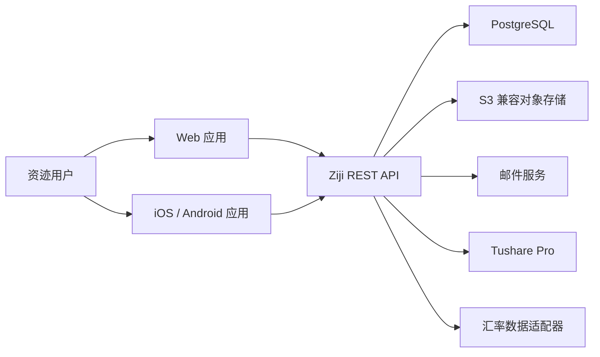
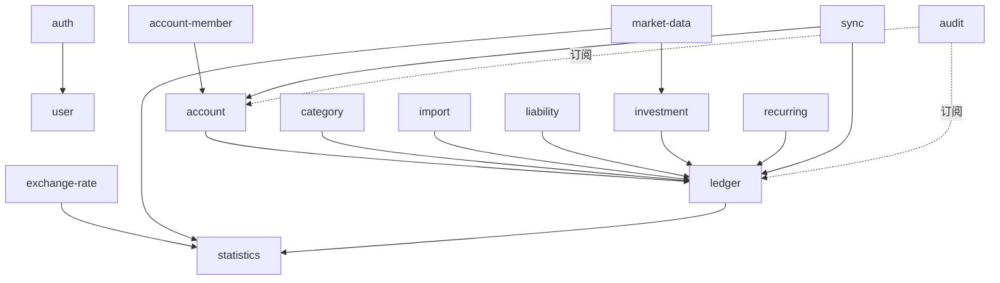
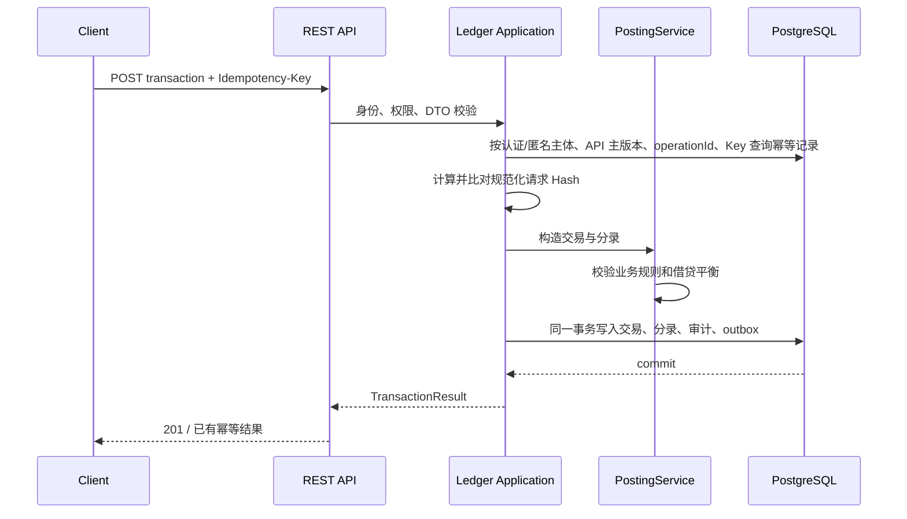
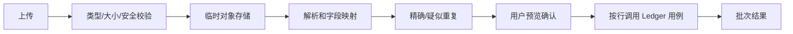
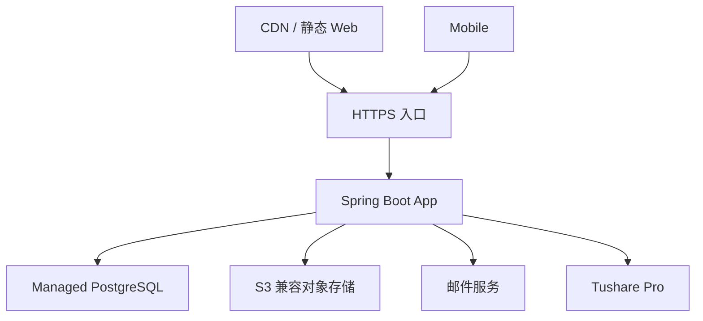

# 资迹 Ziji — 系统架构设计

**文档版本：** V0.1  
**对应产品版本：** V0.1  
**需求基线：** PRD V0.1、RTM V0.1  
**文档状态：** V1 正式设计基线

## 1. 架构目标

V1 架构需要同时满足：

- 财务数据正确、可追溯、可重建
- Web、iOS、Android 共享稳定 API
- 移动端离线录入和多端冲突处理
- 共享账户的资源级权限隔离
- Tushare Pro 等外部数据源可替换
- 在不引入微服务复杂度的前提下支持后续扩展

对应需求：全部 V1 需求，重点为 LED-*、SHR-*、INV-*、SYNC-*、SEC-*、OPS-*。

## 2. 架构原则

1. **模块化单体。** V1 使用一个后端部署单元和一个 PostgreSQL 数据库，通过模块边界控制耦合。
2. **账务核心优先。** 所有资产、负债金额变化必须进入交易与账务模块。
3. **服务端权威。** 服务端负责权限、幂等、版本、账务平衡和最终数据状态。
4. **外部源隔离。** Tushare、邮件和未来汇率供应商通过端口/适配器接入。
5. **投影可重建。** 余额、持仓和统计缓存都是可从事实表重建的投影。
6. **默认安全。** 所有资源访问先确认用户身份、账户成员关系和操作权限。
7. **先简单后扩展。** V1 不使用微服务、Kafka、Kubernetes、Elasticsearch 或默认 Redis。

## 3. 系统上下文



V1 不直接连接银行、微信、支付宝或证券账户。账单通过用户上传文件导入。

## 4. 技术架构

### 4.1 后端

- Java 25
- Spring Boot 4
- Spring MVC
- Spring Security
- Spring Modulith
- jOOQ
- Flyway
- PostgreSQL
- REST + OpenAPI 3.1

框架职责固定如下：

- Spring MVC 承载同步 REST API，不在 V1 同时引入 WebFlux 请求模型
- Spring Security 统一处理认证、会话、CSRF 和入口授权；application 层仍必须执行账户资源级权限校验
- Spring Modulith 声明并验证业务模块边界，承载模块事件和架构测试，不把模块事件等同于跨进程消息
- jOOQ 只在 infrastructure 层提供类型安全 SQL 和持久化实现，不把生成表对象泄漏到 domain 层

推荐采用分层的六边形结构：

```text
interfaces     REST、任务入口、事件消费者
application    用例编排、事务和权限边界
domain         聚合、值对象、策略和领域服务
infrastructure jOOQ、外部 API、对象存储、邮件
```

模块间不得直接访问对方数据库表对应的 jOOQ Repository。跨模块调用通过公开的 application port 或领域事件完成。

### 4.2 Web

- React
- TypeScript
- Vite
- Tailwind CSS
- Radix UI / shadcn/ui
- TanStack Query
- React Router
- Zustand
- ECharts
- GSAP / @gsap/react
- React Bits Aurora / OGL（仅低信息密度装饰背景）
- openapi-typescript

Web 各框架职责如下：

- TanStack Query 管理服务端状态、请求生命周期和缓存
- Zustand 只管理界面、草稿和跨组件流程状态，不复制账户余额、持仓等服务端财务事实
- Tailwind CSS 提供样式工具；Radix UI 提供无样式可访问性原语；shadcn/ui 组件源码纳入项目并允许按设计系统修改
- React Router 管理页面路由；ECharts 用于 Dashboard、趋势和投资图表
- GSAP 只负责 Web 复杂动画编排，统一通过 `useGSAP`、Motion Token 和 scoped cleanup；简单状态过渡仍使用 CSS，Mobile 不复用 DOM 动画实现
- React Bits Aurora 只通过项目封装提供 WebGL 装饰背景；限制 1.5 DPR/30fps，离屏或后台暂停并提供 reduced-motion/CSS 静态降级，不得进入 Dashboard、流水或两类日历等数据密集页面
- openapi-typescript 从正式 OpenAPI 生成 TypeScript 类型，生成文件不得手工修改

Web 负责界面状态和服务端缓存，不复制账务计算规则。金额、收益和权限结果以服务端为准。

### 4.3 Mobile

- React Native
- Expo
- Expo Router
- TypeScript
- NativeWind
- Zustand
- SQLite

Expo Router 负责文件路由，NativeWind 负责移动端样式，Zustand 管理本地界面和同步流程状态。与 Web 相同，服务端数据缓存和客户端状态必须分开；Zustand 不作为账务事实源。

移动端维护：

- 已同步数据缓存
- 本地待上传操作队列
- 同步游标
- 冲突副本和用户选择结果

SQLite 不是最终账务数据库。服务端拒绝的本地操作不得继续显示为已同步成功。

### 4.4 API 契约与客户端类型

- `openapi/ziji-v1.yaml` 是 Web、移动端和服务端共享的唯一机器契约
- Web 和移动端通过 openapi-typescript 从同一契约生成 TypeScript 类型
- openapi-typescript 只生成类型；请求封装负责认证、幂等键、If-Match、错误映射和重试策略
- CI 必须检查 OpenAPI lint、破坏性变更和生成类型是否与契约同步
- 数据库结构与 API 模型不得直接一一暴露，服务端仍通过 DTO 和应用用例隔离内部账务结构

### 4.5 时间和数字

- 服务端时间戳使用 UTC `timestamptz`
- 业务日期在入账时由用户确认或按当时用户时区生成并单独存储，入账后不因时区设置变化而改变
- Java 财务数值使用 BigDecimal
- API 财务数值使用十进制字符串，不使用 JSON number
- 数据库使用 PRD 定义的 NUMERIC 精度
- CNY、USD、HKD、EUR 的入账金额为 2 位，JPY 为 0 位；数量、价格和汇率最多 12 位
- 入账金额、手续费和税费在入账边界使用 `HALF_UP`；统计以允许精度聚合，只在最终展示时按展示币种舍入一次
- 持仓成本保留 8 位、平均成本保留 12 位、比例和收益率保留 6 位；中间计算不得提前舍入

## 5. 后端模块



### 5.1 模块职责

| 模块 | 职责 | 不负责 |
| --- | --- | --- |
| auth | 注册、登录、验证码、会话、密码重置 | 用户资产权限 |
| user | 用户资料、时区、基准币种 | 认证凭据校验 |
| account | 账户生命周期、账户账务科目、流动性占用 | 流水入账规则 |
| account-member | 邀请、角色、计入设置历史 | 余额计算 |
| ledger | Transaction、LedgerEntry、冲正、余额投影 | 外部账单解析 |
| category | 分类、标签、合并映射 | 收支金额计算 |
| import | 文件解析、映射、去重、批次确认与撤销 | 绕过 ledger 直接写分录 |
| investment | Trade、持仓、成本、收益 | Tushare SDK 细节 |
| market-data | Instrument 映射、Tushare 同步、价格/净值快照 | 持仓收益计算 |
| exchange-rate | 汇率快照和供应商适配 | 修改原币账务 |
| liability | 负债资料和业务命令 | 独立保存另一套余额 |
| statistics | Dashboard、趋势、变化归因 | 修改事实交易 |
| recurring | 周期规则和待确认候选 | 未经确认直接入账 |
| sync | 增量游标、幂等操作、冲突 | 复制领域规则 |
| audit | 审计日志、查询和保留策略 | 业务状态变更 |

## 6. 核心请求流程

### 6.1 写入交易



关键点：

- 权限校验和入账发生在同一服务端请求内
- 幂等记录、事实数据和 outbox 原子提交
- 同一作用域、同一幂等键且请求 Hash 相同，返回首次结果；Hash 不同则返回 `IDEMPOTENCY_KEY_REUSED`
- 投影失败不能回滚已提交事实；后台按消费者自己的 outbox receipt 重试投影

Ledger 的审计和 outbox 采用以下固定写入链：Ledger application 在同一最外层事务中保存 Transaction、
LedgerEntry 和明细；经 `audit.application.AuditLogWritePort` 同步追加该次成功转换的 audit fact；再写入
Ledger outbox fact 和适用的幂等终态。Ledger 不得直接访问 audit infrastructure、audit jOOQ、`audit_logs`、
outbox consumer 或其他模块的 repository。审计 adapter 与 Ledger outbox adapter 可以共享当前事务连接，但不能
在业务事实提交后另开事务补写。

初次入账、修订、作废的审计 action 分别固定为 `TRANSACTION_POSTED`、`TRANSACTION_REVISED`、
`TRANSACTION_VOIDED`，resourceType 固定为 `TRANSACTION`，resourceId 固定为被操作业务版本链的根交易 ID；
详细 metadata、reasonCode 和关联规则以领域§7.4、数据库§14.2 为准。Ledger outbox 使用
`aggregate_type='Transaction'`，并且 `TransactionPosted` 与 `TransactionReversed` 是唯一可写 `event_type`；
详细 aggregate、payload、逻辑顺序和消费者幂等规则以领域§15、数据库§14.1 为准。

修订/作废的原 Transaction 版本同时记录迁移前 `originalEntityVersionBefore` 与迁移后
`originalEntityVersionAfter`，后者固定为前者加 1；修订替代 Transaction、冲正 Transaction 已确认写入后的版本
分别为 `replacementEntityVersion`、`reversalEntityVersion`。`TransactionPosted.payload.entityVersion` 指向初次或
替代 Transaction 写入后的版本，`TransactionReversed.payload.entityVersion` 指向冲正 Transaction 写入后的版本，
并以 `reversalOfEntityVersionBefore` / `reversalOfEntityVersionAfter` 表示被冲正原 Transaction 的状态迁移前/后版本。
审计 `requestId` 只使用当前受控 HTTP 请求或系统任务的 requestId / correlation ID，不得由任何交易、outbox、
客户端操作、幂等或其他业务资源 ID 代替。

余额投影、统计投影和后续同步只消费版本化的最小 outbox 定位信息，经 Ledger 公开读取边界取得事实；它们不能
修改 Transaction/LedgerEntry 或把投影结果作为账务事实。每个消费者使用 `outbox_consumer_receipts` 的
`(consumer_name,outbox_event_id)` 独立 claim、lease、retry 和完成；`outbox_consumer_subscriptions` 持久化
aggregate/event 范围和发生时有效的订阅义务，非订阅事件在过滤阶段不得 claim。审计不等待 outbox 异步消费：它与
Ledger 事实同步追加，保证交易、分录、审计和 outbox 在一次提交后同时可见。任一账务、
审计、outbox 或幂等终态写入失败，整个最外层事务回滚，不能留下四类事实中的任一部分。

### 6.1.1 统一幂等取得、并发和终态

幂等作用域固定为“主体 + API 主版本 + operationId + Key”。认证写操作的主体是已校验身份的 `user_id`；公开 `registerUser`、`resetPassword` 的主体是 `HMAC-SHA-256(K_idempotency, frame("ZIJI-IDEMPOTENCY-ANONYMOUS-EMAIL-V1", normalizedEmail))`。`frame` 对每段 UTF-8 字节使用无歧义的 4 字节大端长度前缀，`normalizedEmail` 使用既有 NFKC、trim、`Locale.ROOT` 小写规则。匿名 HMAC 密钥由外部密钥配置提供，和验证码限流 HMAC 分离；数据库只保存 32 字节摘要和正整数版本，不保存邮箱、密码、验证码或 Token。

请求通过格式、认证、CSRF、权限和限流校验后，应用在一个 PostgreSQL 事务内按唯一作用域取得或创建记录。实现使用参数绑定的原子 `INSERT ... ON CONFLICT`/行锁，并将数据库锁等待上限设为 5 秒；同 Key 异 Hash 返回 `409 IDEMPOTENCY_KEY_REUSED`，不改写原记录。相同 Hash 的并发请求在锁于 5 秒内释放时读取终态并重放；超过上限或遇到未过租约的 `PROCESSING` 时返回 `409 IDEMPOTENCY_REQUEST_IN_PROGRESS` 和 `Retry-After: 5`，不在应用层轮询，也不得并行执行业务写入。

新记录先在当前事务内置为 `PROCESSING`，然后同一事务写入业务事实、审计、outbox 和终态；正常路径不得单独提交 `PROCESSING`。`PROCESSING` 的 30 秒租约仅用于异常遗留行恢复：租约到期后，同 Key/Hash 请求在行锁内原子接管。进程崩溃或事务回滚会一起回滚幂等记录和事实，不能留下正常路径的孤儿状态。`FAILED_RETRYABLE` 仅用于已安全确认没有业务事实/outbox 的暂时性 5xx，记录 `completed_at + 5 秒` 后才允许同 Key/Hash 串行接管；`SUCCEEDED` 与 `FAILED_FINAL` 只重放首次的安全引用和稳定状态，不重新执行用例。

匿名密钥轮换时，所有读取同时计算当前和上一版本摘要，新建记录只使用当前版本；上一版本必须至少保留 7 天。切换时以流量围栏或实例排空保证没有旧配置实例继续写入，避免旧/新“当前”版本各自通过唯一索引创建重复记录。

### 6.2 查询 Dashboard

```text
校验用户
→ 读取当前余额/持仓投影
→ 读取历史生效计入设置
→ 获取指定 valuationRevision 下的有效价格和汇率
→ 汇总有效 LiquidityHold 得到不可用金额和可用资金
→ 计算核心指标及变化归因
→ 返回 valuationRevision、数据截至时间和质量告警
```

若投影落后，返回 `projectionAsOf` 和数据质量状态。不得把部分失败的资产默认为 0。

### 6.3 导入账单



文件解析在受限工作进程中完成。电子表格中的公式一律按不可信输入处理，不执行宏或公式。

V1 的上传能力只服务于微信、支付宝、银行 CSV/Excel 和通用 CSV 账单导入。客户端通过 `multipart/form-data` 将文件流式上传至后端；后端在受限大小下同时计算摘要、校验声明类型与文件签名、阻止公式/宏风险，再写入私有对象存储。V1 不提供头像、票据图片或普通附件上传；数据导出属于下载流程。

### 6.4 流动性占用与可用余额

```text
创建、修改或释放 LiquidityHold
→ 校验账户权限、币种、状态、金额和有效期
→ 保存 FROZEN / IN_TRANSIT / RESERVED 占用事实和审计记录
→ 重建或增量更新流动性投影
→ availableBalance = ledgerBalance - unavailableAmount
```

LiquidityHold 不产生 LedgerEntry，也不改变资产总额或净资产。有效占用超过账面余额时允许返回负可用余额，同时必须附带数据质量警告；其当前值和历史值都可由占用事实重建。

LiquidityHold 的公共写入 source 固定为 `MANUAL`，类型为 `FROZEN`、`IN_TRANSIT` 或 `RESERVED`；API `reason` 直接落到 `liquidity_holds.note`。修订必须显式提交类型和新 reason，旧版本以 `SUPERSEDED` 结束并由审计 action `LIQUIDITY_HOLD_REVISED` 记录，不能接收后丢弃没有数据库归宿的 `revisionReason`。

有效性按请求时点计算，未来 `effectiveAt` 只返回 `PENDING`，不提前计入不可用金额；到达 `expiresAt` 即逻辑 `EXPIRED`，即使最终化尚未运行，查询和释放/修订前置校验也必须按过期判断。现有 PostgreSQL advisory-lock 调度机制负责可验证的 `LIQUIDITY_HOLD_EXPIRY_FINALIZER` 任务，将到期事实幂等物化为 `ended_at=expires_at`、`end_reason=EXPIRED` 并递增版本。它与手工释放/修订共享当前版本串行化，第一笔成功终止转换获胜，另一笔不能覆盖。

账户 LiquidityHold 列表返回完整修订历史，包含 PENDING、ACTIVE、RELEASED、SUPERSEDED 和 EXPIRED，固定使用 `created_at DESC, id DESC` 的不透明 keyset 游标；游标绑定账户、过滤条件和排序，不能含 SQL 或可枚举内部资源信息。所有账户相关操作先确认 ACTIVE AccountMember，再按 OWNER/EDITOR/VIEWER 角色判定；`accounts.created_by` 只用于审计。

### 6.5 投资入账与历史数据修订

投资账户固定包含一个 `PRIMARY` 券商现金科目和一个 `POSITION_COST` 内部成本科目。买卖的现金变动、持仓成本变动和费用分录在同一 Transaction 内提交；`POSITION_COST` 仅用于成本重建，不得与 `PRIMARY` 重复计入资产总额。手续费和税费统一费用化，不进入持仓成本，收益统计只扣减一次。投资成交只能由该账户 `PRIMARY` 现金结算；银行卡与投资账户间的入金和出金使用普通转账。

历史价格、净值或汇率被供应商或用户更正时：

```text
新增数据 revision，保留旧 revision
→ 计算受影响业务日期和相邻变化归因区间
→ 通过 outbox 安排日、月、年统计投影重算
→ 发布新的 valuationRevision
→ Dashboard 默认读取最新 revision，审计查询可读取旧版
```

修订不得覆盖原始快照。重算任务必须幂等，并记录来源 revision、目标 revision、影响范围和执行结果。

### 6.6 投资收益日历

收益日历由 statistics 模块读取 ledger、investment、market-data、exchange-rate 和历史计入设置生成，客户端不得自行用行情差值计算。计算链路为：

```text
读取用户时区与统计范围
→ 重建日初/日终券商现金、持仓和成本
→ 选择各日有效价格/净值与汇率 revision
→ 识别组合外部现金流或单一标的现金流
→ 计算日收益与 Modified Dietz 日收益率
→ 写入当前 valuationRevision 的日历投影和标的贡献明细
→ 月历查询按日期返回 CALCULATED / NON_TRADING_DAY / NO_POSITION /
  PENDING_DATA / PARTIAL / UNPRICED
```

日历投影按用户、统计范围、业务日期、基准币种和 `valuationRevision` 版本化。价格、净值、汇率、交易或历史计入设置修订通过 outbox 安排受影响日期和月份幂等重算。`PARTIAL/UNPRICED` 不生成伪造收益；API 明确返回 null 和数据质量原因。

### 6.7 总资产变化日历

总资产变化日历复用 statistics 模块的 `daily_user_asset_snapshots`，不建立第二套资产事实。查询链路为：

```text
按用户时区解析自然月和 TOTAL_ASSETS / NET_ASSETS 指标
→ 读取月首前一日及当月各日的当前 valuationRevision 快照
→ 校验相邻日快照的币种、完整性和修订链
→ 计算每日资产变化及变化率
→ 从 ledger、position、price、exchange-rate 和 inclusion facts 生成日期明细
→ 返回 CALCULATED / NO_ASSETS / PENDING_DATA / PARTIAL / UNAVAILABLE
```

客户端只切换指标和展示服务端结果，不自行相减或归因。总资产日期明细按账户余额、持仓估值及其业务来源解释，净资产归因遵守领域 §9.2；内部转账在聚合边界内抵消。交易、行情、汇率或计入设置修订时，通过 outbox 重算受影响日、相邻日和月份，旧 `valuationRevision` 保留用于审计。

### 6.8 邮箱验证码限流与挑战投递

认证模块不使用 JVM 内存计数或 Redis 作为允许请求的权威。发送验证码请求先规范化用途、邮箱、来源 IP 和可选 `deviceId`，再使用外部密钥配置中的 HMAC-SHA-256 当前及上一版本密钥计算主体摘要；缺失 `deviceId` 使用来源 IP 与 `MISSING_DEVICE` 域标记。来源 IP 默认取连接对端；仅当部署显式配置受信反向代理且代理覆盖外来转发头时接受代理提供的客户端地址，禁止直接信任客户端 `Forwarded`/`X-Forwarded-For`。IPv4/IPv6 在 HMAC 前转为规范二进制地址，IPv4 映射 IPv6 归一为 IPv4。限流桶只保存 32 字节摘要和密钥版本，不保存原始 IP、邮箱或 `deviceId`；挑战事实仍按既有模型保存规范化邮箱用于生命周期校验。

服务端在一个 PostgreSQL 事务中按 `IP → EMAIL → DEVICE`、窗口时长从短到长、密钥版本从小到大的固定顺序原子 UPSERT/锁定并增加全部限流桶计数。`REGISTER` 和 `RESET_PASSWORD` 作为不同 `purpose` 独立计算。任一窗口超限时事务仍提交计数、不创建挑战，并以所有超限窗口最长剩余时间生成 `Retry-After`；本地缓存只能提前拒绝，不能放行请求。

通过限流后，应用在同一事务内将同邮箱同用途的旧活动挑战标记为 `REPLACED`，再保存新挑战的验证码 Hash 和与现有邮件端口/outbox 边界兼容的投递事件；部分唯一索引保证至多一个活动挑战，任一步失败均整体回滚。邮件适配器失败时由 outbox 重试同一挑战，不退还限流次数、不生成第二个验证码。验证码如进入 outbox 载荷必须使用应用层信封加密，普通日志、错误和审计 metadata 不得包含明文验证码。

当前窗口桶在窗口结束或 `blocked_until` 后至少保留 7 天，由后续清理任务删除；上一版本 HMAC 密钥至少保留 48 小时。密钥不进入数据库、仓库或日志。上述数据边界由 `V008__auth_challenge_rate_limits.sql` 冻结，BE-AUTH-001 只负责按该基线实现业务编排。

## 7. 移动端离线同步

### 7.1 本地模型

移动端至少包含：

```text
cached_entities
pending_operations
sync_cursor
sync_conflicts
```

每个本地操作具有：

```text
operationId UUID
idempotencyKey UUID
entityId UUID
baseVersion integer
operationType
payload
createdAt
status
```

### 7.2 同步算法

1. 客户端使用最后确认游标拉取服务器变更。
2. 客户端按服务器顺序应用变更和墓碑。
3. 客户端按本地创建顺序批量上传待处理操作。
4. 服务端逐个执行身份、权限、版本、幂等和领域规则校验。
5. 服务端返回 `APPLIED`、`DUPLICATE`、`CONFLICT` 或 `REJECTED`。
6. 客户端保存新游标并向用户展示冲突。

先拉后推可降低无意义冲突，但不能取代版本校验。

### 7.3 变更日志

服务端维护单调递增变更序列。每次对可同步实体提交变更时，在同一事务写入 change log：

```text
sequence
user visibility scope
entity type / entity id
change type
entity version
changed at
```

共享账户变更需要按变更发生时的成员可见范围投递。`outbox_events.occurred_at` 是同步消费者的 as-of 边界；
membership 使用 `joined_at <= occurred_at` 且 `ended_at` 为空或晚于该时点，inclusion 使用
`valid_from <= occurred_at` 且 `valid_to` 为空或晚于该时点。异步消费执行时的当前 ACTIVE membership 不能替代
变更发生时事实。

变更日志按 `recipient_user_id` 定向投递。普通账户/交易变更以当时 membership 周期确定 recipient；计入比例影响
历史统计范围，不改变账户访问权限。多账户交易使用涉及账户的 recipient 并集，`account_id` 仅在恰好一个可见
账户时填写，否则为 NULL。成员被移除时，客户端收到资源访问撤销墓碑；新成员接受邀请后，通过账户初始化快照
或 bootstrap 变更取得当前可见数据。`ACCESS_REVOKED` 与 bootstrap 的业务触发仍属于 B2 共享成员任务。

每个 outbox 消费者在过滤自身订阅的 `aggregate_type/event_type` 后创建或读取自己的 receipt；不同消费者不共享
attempt、retry、lease 或完成状态。`outbox_events.published_at` 保留为兼容性全局提示字段，V1 不由单一消费者写入，
不能作为任何消费者的 claim 或完成条件。V014 的 `outbox_consumer_subscriptions` 持久化每个消费者的
aggregate/event 订阅范围、`subscribed_from`/`subscribed_until` 有效边界和 `required_for_cleanup` 义务；事件
`occurred_at` 不在有效区间内时不创建该消费者 receipt。事件清理通过
`outbox_event_cleanup_eligibility` 判断事件发生时有效且 required 的每条订阅：每条都必须存在
`SUCCEEDED` 或 `FAILED_FINAL` receipt，缺少 receipt 不能被解释为不需要处理。非 required 或非订阅消费者不阻塞
清理。新消费者只能从持久订阅起点之后正常消费，历史回放必须使用显式、可审计的 backfill；V014 不向
`ziji_app` 授予无约束 DELETE，清理由后续受控 retention adapter 执行。

### 7.4 冲突

- 服务端不执行静默最后写入覆盖
- 冲突返回服务器当前版本和可比较字段
- 财务交易冲突通过重新提交修改/冲正命令解决
- 权限撤销属于不可合并拒绝
- 同一批上传中的一笔 Transaction 和其分录是一个原子项

### 7.5 同步重试与统一幂等

同步上传复用 §6.1.1 的认证主体、作用域、请求 Hash 和生命周期；`SyncOperation.idempotencyKey` 不能绕过普通 HTTP 幂等记录。作用域中的 operationId 固定为实际 OpenAPI `applySyncOperations`，客户端 `SyncOperation.operationId`、操作类型和实际资源标识进入 Hash；不同用户、API 主版本或实际资源标识属于不同请求，同一用户复用同 Key 于不同资源或载荷时因 Hash 不同稳定拒绝。`FAILED_FINAL` 以首次安全 Problem 重放，`FAILED_RETRYABLE` 在 5 秒退避后才可串行重试，客户端不能自行并行补发。

## 8. Tushare Pro 与市场数据

### 8.1 适配器

```text
MarketDataPort
├── searchInstruments
├── syncInstrumentBasics
├── syncDailyPrices
└── syncFundNav

TushareMarketDataAdapter implements MarketDataPort
ManualMarketDataAdapter implements MarketDataPort
```

核心模块只识别内部 Instrument、PriceSnapshot 和同步结果。

### 8.2 调度策略

- 交易日历每日低频同步
- A 股和 ETF 日线在预计收盘数据稳定后批量同步
- 场外基金净值按最新公布日期增量同步
- 只为系统已使用或近期搜索的产品优先同步，避免无边界拉取
- 相同 source、externalCode、priceType、businessDate 唯一
- 失败使用指数退避并设置最大重试次数

具体执行时间通过配置管理，不把供应商更新时间硬编码到领域逻辑。

### 8.3 权限和凭据

- Tushare Token 只存在于服务端密钥管理设施
- 启动时读取，不写数据库普通配置表
- 日志、指标标签和异常信息不输出 Token
- 适配器内实现限流器和每日调用配额计数
- 权限不足和调用超限属于可观测业务失败，不进行无限重试

### 8.4 降级

```text
自动数据成功 → 使用最新有效外部快照
自动数据失败但有旧快照 → 使用旧快照并标记过期
无外部快照但有手工价格 → 使用手工价格
均不存在 → 标记 UNPRICED，不按 0 计算
```

V1 实时行情不是发布门禁。

## 9. 身份、权限和安全

### 9.1 会话方案

V1 采用：

- 短期访问 Token
- 服务端保存、可撤销的轮换刷新会话
- 每个设备独立会话记录
- 密码重置后撤销该用户全部刷新会话

`user_sessions` 表示稳定设备会话。刷新 Token 的每次签发和轮换由独立 `session_refresh_tokens` 保存强 Hash、消费状态和轮换关系，不保存明文；轮换不改变 `sessionId`，旧 Token 重用会撤销整个设备会话。

稳定会话与刷新 Token 都是固定 30 天绝对有效期，轮换不滑动延长 `expiresAt`。每次成功登录创建新的 `sessionId`；同一用户携带相同非空 `deviceId` 再次登录时，在同一数据库事务撤销旧活动会话及刷新 Token（`REPLACED_BY_LOGIN`）并创建新会话，缺失 `deviceId` 时不替换。`deviceName` 经 NFKC、trim 后保存；`deviceId` 是保持客户端原值的不透明稳定标识，不做 NFKC/trim，非空时限 1～200 字符且不得全空白。`lastSeenAt` 只在创建和成功刷新时单调更新。新刷新 Token 固定 `createdAt = issuedAt < expiresAt`；正常刷新在同一 PostgreSQL 事务内锁定当前 Token、消费旧 Token、插入新 Token、建立 `replacedById` 并更新会话；任何失败整体回滚，已消费 Token 保留给后续重用攻击处置。

Access Token 固定为 RS256 JWT，RSA 密钥至少 2048 位，header 必须为 `alg=RS256`、`typ=at+jwt` 和受控 `kid`；claims 必须含 `iss=ziji-backend`、`aud=ziji-api`、`sub`、`sid`、`jti`、`iat`、`nbf`、`exp`。有效期 30 分钟、时钟偏差最多 60 秒且不得超过会话到期。当前私钥只签发，当前和上一受信公钥按明确 `kid` 验证；上一公钥停止签发后至少保留 24 小时。私钥、公钥、Access Token 和原始 Refresh Token 都不得持久化或写入日志、异常、审计 metadata、outbox、幂等记录。

Web 登录和刷新使用 `Secure`、`HttpOnly`、`SameSite` Cookie，并对状态变更请求执行 CSRF 校验；移动端由专用会话接口在响应体返回刷新 Token，客户端保存于 Keychain/Keystore。两组 operationId 分离，但复用同一认证应用服务。

邮箱密码登录先完成凭据认证和固定窗口防暴力破解，再由会话用例创建稳定设备会话及对应刷新凭据。认证阶段只返回安全认证结果：`ACTIVE`、`CLOSING` 可通过；`LOCKED`、`CLOSED`、不存在邮箱、损坏/不支持的 Hash 和密码错误统一为 `401 INVALID_CREDENTIALS`。所有语法合法请求按 `IP(10m/30、24h/300) → EMAIL(15m/10、24h/50)` 在 PostgreSQL 原子计数，超限仍提交计数并返回最长 `Retry-After`；登录使用独立 HMAC 域且不使用 deviceId 作为限流主体。不存在邮箱和任意已存在状态均执行一次 Argon2id 校验，dummy Hash 仅在启动时生成一次并复用。

BE-AUTH-003 负责凭据认证、限流和统一失败；BE-AUTH-004/007 才负责稳定设备会话、访问 Token、刷新 Token、Web Cookie 与 Mobile 响应体。不得为了认证阶段提前创建会话或暴露状态差异。

### 9.2 授权顺序

每个资源请求执行：

```text
认证用户
→ 确认资源所属账户
→ 查询 ACTIVE AccountMember
→ 校验角色所允许的操作
→ 在写入前再次校验版本和状态
```

只依赖客户端隐藏按钮不构成权限控制。

所有账户均在创建时具有至少一个 ACTIVE OWNER；`accounts.created_by` 只用于审计，不参与授权捷径。

### 9.3 数据保护

- 密码使用 Argon2id；参数按部署硬件基准确定并版本化
- HTTPS 终止后到后端的内网链路仍应受信任和限制
- 高敏感字段应用层信封加密
- 数据库、对象存储和备份启用静态加密
- 移动端使用系统 Keychain/Keystore 保存 Token
- SQLite 使用受支持的加密实现并由安全存储保护密钥

### 9.4 安全边界

- 导入文件是不可信输入
- Tushare、汇率和邮件响应是不可信外部输入
- 所有枚举、金额、日期、文件字段和分页参数服务端校验
- 账户、交易和导入查询必须包含用户可见性约束
- 审计日志不得由普通业务 API 修改

## 10. 性能和容量

标准用户规模：100 个账户、100,000 条流水、1,000 个持仓价格快照。

### 10.1 目标

| 场景 | 服务端目标 |
| --- | --- |
| Dashboard | P95 ≤ 2 秒 |
| 流水列表 | P95 ≤ 1 秒 |
| 10,000 行账单解析和去重 | ≤ 60 秒 |

### 10.2 策略

- 流水列表使用游标分页
- Dashboard 使用余额、持仓和日终统计投影
- 投影包含 `as_of_sequence`，支持识别落后状态
- 账务事实表按账户、业务日期和交易 ID 建立组合索引
- 导入解析异步执行，查询任务状态
- Tushare 数据全局共享缓存，不按用户重复保存同一行情

### 10.3 Redis

V1 默认不引入 Redis。以下情况经过实测再评估：

- 多实例分布式定时任务互斥
- 高并发认证限流
- 热点 Dashboard 缓存无法由 PostgreSQL 满足

在引入前，使用 PostgreSQL advisory lock、数据库限流记录和本地短时缓存完成 V1。

## 11. 数据可靠性与运维

### 11.1 备份

- PostgreSQL 定期全量备份和持续 WAL 归档
- 对象存储开启版本控制或等价恢复能力
- 备份加密并限制访问
- 定期执行隔离环境恢复演练

恢复后必须运行：

- 交易分录平衡校验
- 账户余额重建对账
- 持仓数量和成本重建对账
- 账户成员和权限完整性校验

### 11.2 可观测性

日志：

- 结构化日志和统一 requestId
- 禁止记录密码、验证码、Token、完整导入内容
- 财务操作记录业务 ID，不记录不必要的敏感详情

指标：

- API 延迟、错误率和数据库连接池
- 同步积压、冲突率和幂等命中率
- 导入成功率、失败行数和耗时
- Tushare 调用次数、限流、权限错误和数据新鲜度
- outbox 积压和投影延迟

告警：

- 账务不平衡尝试
- 余额重建差异
- 市场数据连续失败或过期
- 备份、恢复演练失败
- 异常登录和验证码攻击

### 11.3 审计和保留

审计日志采用追加写入。数据保留期和账号注销处理必须在上线前根据适用法规和运营主体确定，不能由开发人员临时决定。

LiquidityHold 创建、修订、释放和自动过期均写入 `audit_logs`；修订使用 action `LIQUIDITY_HOLD_REVISED`，释放使用 `LIQUIDITY_HOLD_RELEASED`，自动过期使用 `LIQUIDITY_HOLD_EXPIRED`。审计 metadata 只保存脱敏后的 account/hold/version、类型变更和原因代码，不保存 SQL、完整请求体、Token 或密钥。业务角色只能在授权账户范围 INSERT/SELECT，不能 UPDATE/DELETE。

Ledger 初次入账、修订和作废同样使用追加审计，但不复用 LiquidityHold action：分别为
`TRANSACTION_POSTED`、`TRANSACTION_REVISED`、`TRANSACTION_VOIDED`。审计资源为原业务版本链 root，修订/作废
原因文本只留在冲正 Transaction 的 `note`，不得进入 audit metadata 或 outbox payload。Ledger 的审计写入通过
audit.application 公共追加端口完成；审计 `requestId` 是当前 HTTP 请求或系统任务的 correlation ID，不是业务
资源标识；审计 adapter 不反向读取或修改 Ledger infrastructure。

## 12. 部署拓扑

### 12.1 V1 推荐拓扑



初期单应用实例即可运行。水平扩展到多实例时：

- API 保持无状态
- 刷新会话保存在 PostgreSQL
- 定时任务使用 PostgreSQL advisory lock 防止重复执行
- 每个 outbox 消费者使用自己的 receipt 表行和数据库抢占/跳过锁定机制；同一消费者多实例只能有一个有效 claim，
  不同消费者可以并行处理同一 outbox event

### 12.2 环境

- local：开发者本地，使用模拟邮件和外部数据适配器
- test：自动化集成测试，隔离数据库
- staging：生产等价配置，使用受控第三方测试凭据
- production：正式数据和严格密钥、备份、告警策略

生产凭据不得复制到 local 或自动化测试环境。

## 13. 工程结构

```text
backend/
  modules/
    auth/
    user/
    account/
    account-member/
    ledger/
    category/
    import/
    investment/
    market-data/
    exchange-rate/
    liability/
    statistics/
    recurring/
    sync/
    audit/
  bootstrap/
  db/migration/

web/
  src/
    app/
    routes/
    features/
    components/
    stores/
    generated/
mobile/
  app/
  src/
    features/
    components/
    stores/
    sync/
    database/
    generated/
packages/
  api-types/
scripts/
openapi/
doc/
prototypes/
```

工程采用单 Git 仓库：后端使用 Maven Wrapper；Web、Mobile 和 `packages/api-types` 使用 pnpm workspace。`packages/api-types` 只存放 OpenAPI 生成类型，不共享客户端 UI 或账务算法。V1 不引入 Nx、Turborepo、Bazel 等额外编排器。完整理由、被否决方案和升级边界见 `doc/adr/ADR-024-工程工具链与工作区.md`。

## 14. 架构决策记录

后续应建立以下 ADR：

| ADR | 决策 | 当前结论 |
| --- | --- | --- |
| ADR-001 | 后端架构 | 模块化单体 |
| ADR-002 | 账务事实源 | Transaction + LedgerEntry |
| ADR-003 | 写入历史 | 冲正，不物理删除 |
| ADR-004 | 同步权威 | Server Authoritative + 乐观版本 |
| ADR-005 | 市场数据 | Tushare Pro 适配器 + 手工兜底 |
| ADR-006 | 消息机制 | PostgreSQL outbox，不引入 Kafka |
| ADR-007 | 认证会话 | 短访问 Token + 可撤销轮换刷新会话 |
| ADR-008 | Dashboard | 可重建投影 + 数据截至序列 |
| ADR-009 | 可用余额 | LiquidityHold 事实 + 可重建流动性投影 |
| ADR-010 | 投资账户科目 | PRIMARY 现金科目 + POSITION_COST 内部成本科目 |
| ADR-011 | 历史市场数据修订 | 保留 revision、自动重算、默认展示最新版 |
| ADR-012 | 幂等作用域 | 用户 + API 主版本 + operationId + Key，并校验请求 Hash |
| ADR-013 | 账户授权 | 所有账户统一使用 AccountMember，创建者为初始 ACTIVE OWNER |
| ADR-014 | 设备会话 | 稳定 session + 独立轮换 refresh token 记录；Web Cookie/Mobile 响应体 |
| ADR-015 | 文件上传 | V1 仅账单导入使用后端流式代理 |
| ADR-016 | 同步可见性 | change log 按用户定向投递，支持 ACCESS_REVOKED 与 bootstrap |
| ADR-017 | 业务日期 | 入账时冻结，用户时区修改不回改历史归属 |
| ADR-018 | 基准币种 | 历史默认按当前基准币种和对应日期汇率展示 |
| ADR-019 | 后端应用框架 | Spring MVC + Spring Security + Spring Modulith + jOOQ |
| ADR-020 | Web 框架 | React + Vite + Tailwind CSS + Radix/shadcn + TanStack Query + Zustand + ECharts |
| ADR-021 | 移动端框架 | React Native + Expo Router + NativeWind + Zustand + SQLite |
| ADR-022 | 客户端契约类型 | OpenAPI 3.1 + openapi-typescript，同源生成 Web/Mobile 类型 |
| ADR-023 | 自动化测试框架 | JUnit/Testcontainers + Vitest/Playwright + Maestro |
| ADR-024 | 工程工具链与工作区 | Maven Wrapper + pnpm workspace + 单 Git 仓库；只共享 OpenAPI 类型 |
| ADR-025 | Web Motion | GSAP + `@gsap/react` + 统一 Motion Token；Mobile 不引入 GSAP |
| ADR-026 | Web Aurora 背景 | React Bits Aurora + OGL 项目封装；仅低信息密度页面并强制静态降级与暂停 |

## 15. 上线前架构门禁

1. 核心领域与账务已冻结决策在数据库、API 和测试实现中保持一致。
2. Tushare Pro 商业使用和数据展示授权得到书面确认。
3. 邮件服务商、汇率数据源、部署区域和隐私主体确定。
4. 备份恢复演练通过，账务重建差异为 0。
5. API 权限、幂等、同步冲突和性能测试达到验收标准。
